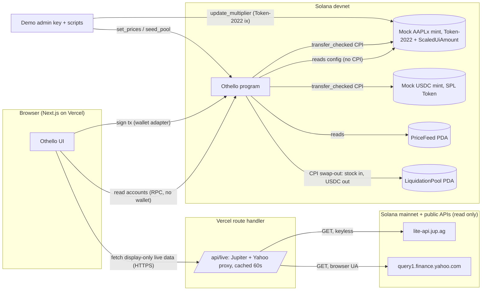

# Architecture

## 2. Solution strategy

1. **Raw units on-chain, presentation at the edge.** Every value the program stores is raw token units or USDC base units. Multiplier becomes a fixed-point integer by exact IEEE-754 decode. The UI alone converts to scaled amounts. (Solana's own guidance: Scaled UI Amount is a presentation layer.)
2. **Pulled, not pushed.** No keeper. Every transition is an instruction someone signs, and the program checks time against the Clock sysvar. Coverage and allocations are recomputed from scratch inside every state-changing instruction, so there is no stale cached solvency to trust.
3. **Mocks behind two accounts.** `PriceFeed` and `LiquidationPool` are the only devnet-specific parts. Replacing them with a real oracle and a DEX route is an adapter change, not a redesign.

## 3. Architecture



**Trust boundaries:** wallet ↔ program (signature), admin ↔ PriceFeed/Pool/mint (admin signature; devnet only), server route ↔ public APIs (display only, never enters program state), browser ↔ server route (public, rate limited by cache).

**On/off-chain rule:** anything that decides who gets money is on-chain. Live mainnet data is display only (SPEC v4 note 3).

**Liquidation pool as instructions of the same program** (ADR-004): `LiquidationPool` is a PDA of the Othello program, not a separate program. Default seizes stock into the pool's stock vault and moves USDC from the pool vault to the circle vault inside one instruction. No cross-program swap.

## 9. Failure modes (severity first)

| Component | Failure | Effect | Control | Detection | Sev |
|---|---|---|---|---|---|
| Valuation | float rounding up | overvalued collateral | exact bit decode (I5) | vectors | Critical |
| PriceFeed | updated before multiplier activates | false Critical, false default | D5 epoch match (I13) | refusal code | Critical |
| Reserve | double-counted allocation | payout on empty guarantee | recompute from scratch (I2) | property test | Critical |
| Admin key | leaked on devnet | fake prices | devnet only, stated | n/a | Accepted |
| Mint issuer powers | pause/freeze vault (real xStock) | liquidation fails | out of scope, stated | n/a | Accepted (limit) |
| Devnet RPC | rate limited / slow | UI stalls | reads batched per page load; show "last read" | UI state | Major |
| Program deploy | out of devnet SOL | cannot deploy/upgrade | see section 10 | preflight | Major |
| Yahoo endpoint | blocked/changed | Stock view degraded | cached; "live data unavailable" state | UI | Minor |
| Clock | validator skew ±seconds | default a few s early/late | grace ≥ 60 s | n/a | Minor |

## 10. Capacity and cost

- Loops bounded by n ≤ 8. `release_pot` recomputes 8 members: 8 × (2 u128 mul-div) plus one mint TLV parse. ASSUMPTION ≤ 60k CU; gate 2 records the real number.
- Rent (rent-exempt = 6,960 lamports per byte incl. 128-byte header, 2-year): Circle ≈ 128 + 8 + ~640 B → ~0.0054 SOL; Member ≈ 8 + ~130 B → ~0.002 SOL; 4 token vaults ≈ 0.002 SOL each (Token-2022 slightly more).
- **Program deploy is the real cost.** A ~300 KB program: 300,000 × 6,960 = 2.09 SOL locked, plus the same again temporarily in a buffer for each upgrade. **Joshua has ~2.5 devnet SOL. That is one deploy with no room for an upgrade.** Mitigation in PREFLIGHT: top up from the devnet faucet before gate 2, deploy with `--max-len` equal to the measured binary size (plus ~20% for one upgrade), build with `opt-level = "z"`-style size settings if needed, and close failed buffers (`solana program close --buffers`).
- Hosting: Vercel hobby (free), one route handler with a 60 s cache. Public devnet RPC by default; a free-tier RPC key only if rate limited (it would be a `NEXT_PUBLIC_` key and therefore public: acceptable for devnet reads).
- $ cost: 0.

## 11. Security (Tier 1)

**Actors, roles, privileges**

| Actor | Can | Cannot |
|---|---|---|
| Creator | create, activate, cancel while Forming | touch funds after activation |
| Member | join, leave while Forming, contribute, add stock, top up, withdraw own | move others' funds |
| Anyone | release_pot, update_coverage, declare_default, quote | receive any funds from these |
| Demo admin (the program's upgrade authority, r6) | set prices, seed pool, change multiplier | move member funds (I8) |
| Upgrade authority (Joshua's devnet key) | replace the program | nothing prevents it on devnet: accepted limit, stated on the site |

**STRIDE on the wallet ↔ program boundary:** Spoofing: seeds bind Member to wallet; `wallet == members[turn]` checked. Tampering: every account constrained by seeds, `has_one` and mint equality; token accounts checked for owner + mint (Token-2022 vs SPL program ids checked). Repudiation: an event per state change. Built: `CircleCreated, MemberJoined, MemberLeftForming, CircleActivated, CircleCancelled, Contributed, PotReleased, PotRefused, RoundNotFunded, CoverageUpdated, Withdrawn, PricesSet, PoolInitialized, PoolSeeded`. Planned with T15 and T16: `DefaultDeclared, ReserveToppedUp, StockAdded`. `PotRefused` and `RoundNotFunded` are emitted by a failing transaction and are read from its logs under simulation (SPEC §9). Information disclosure: none private. DoS: anyone-callable ixs are idempotent or state-gated; no unbounded loops. Elevation: `init_price_feed` and `init_pool` require the program's upgrade authority (ProgramData), and the other admin ixs check the `feed.authority`/`pool.authority` those two recorded (r6); no admin path to vaults.

**Smart-contract top risks addressed:** business logic (the gate and waterfall, I1-I3, I9-I11), arithmetic rounding direction (collateral down, obligations up), oracle manipulation (admin-only on devnet, D5 epoch check, staleness), non-standard tokens (Token-2022 `transfer_checked` with the mint passed; mock mint has **no** transfer hook).


## Repository layout (builders must follow)
```
programs/othello/src/        Anchor program (lib.rs, state.rs, valuation.rs, instructions/*.rs, errors.rs, events.rs)
tests/                       Anchor TS tests (ts-mocha); clock warp via LiteSVM or bankrun (gate 1 decides, ADR-011 records)
ops/                         TS scripts: create-mock-mint.ts, schedule-split.ts, set-prices.ts, touch-prices.ts, seed-demo-circle.ts, run-round.ts, trigger-default.ts
app/                         Next.js app (App Router), wallet adapter, /api/live route reusing ../lib/pegdata.js logic
scripts/                     harness check scripts only (do not add app scripts here)
```
## Pinned versions (looked up 2026-09-21; gate 1 confirms and records resolved versions in DONE.md)
anchor-lang / anchor-spl 1.1.x · spl-token-2022-interface 2.1.0 (or whatever anchor-spl 1.1.x resolves) · Node per .nvmrc · Rust per rust-toolchain.toml · pnpm lockfile committed.
