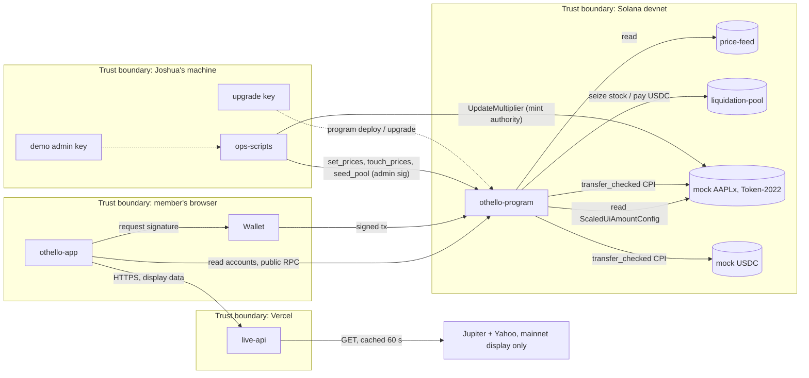
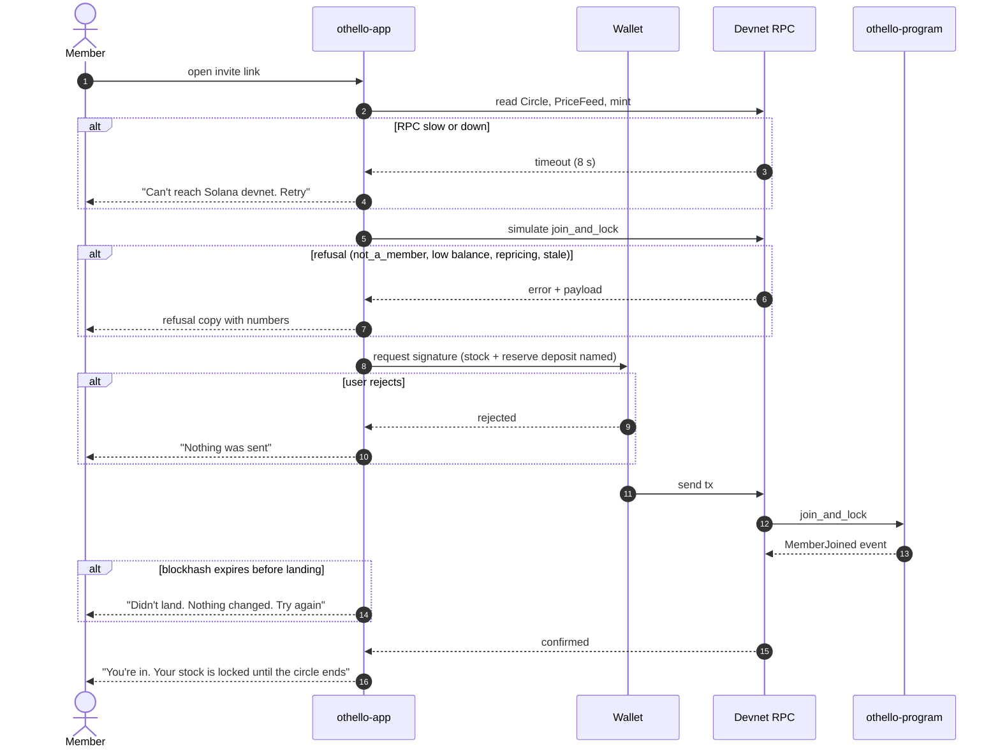
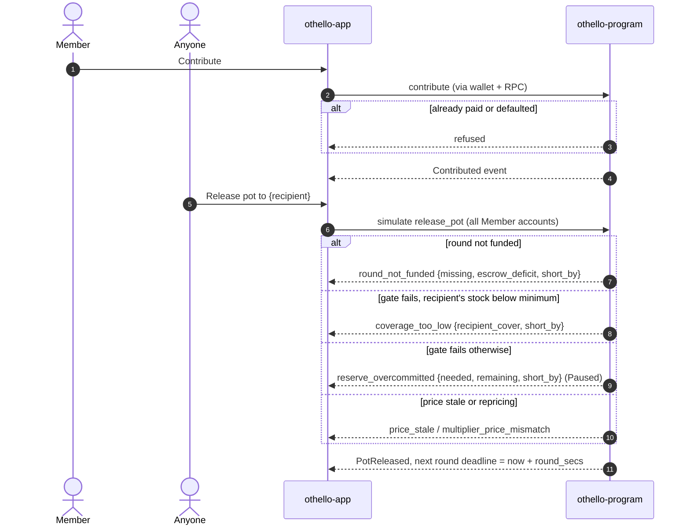
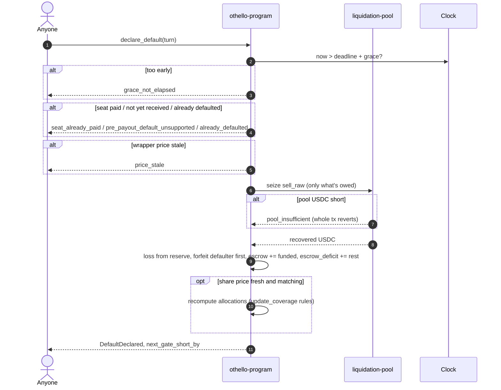
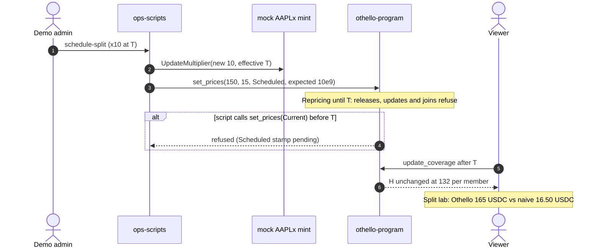
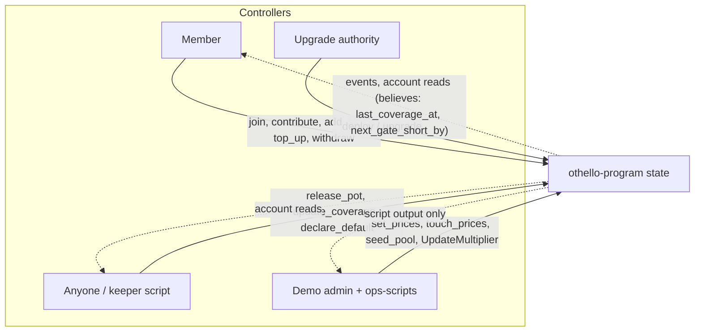

# Othello Atlas

::masthead:: **Nothing is built yet.** Gate 1 (the valuation spike) has not started. Every page below describes the *frozen design* (SPEC.md, 2026-09-21), not observed behaviour, and carries `verified_by: nothing`. Each gate replaces a "designed" stamp with a real one.

## 0. Read me first

::stamp:: owner: joshua · last_verified: 2026-09-21 · verified_by: manual walkthrough of SPEC.md · hops: none

**Why this exists.** Rotating savings circles (ajo, esusu, susu, tanda) break the same way everywhere. Someone collects the pot early, then stops paying, and the others have nothing but their word. Othello lets members lock tokenized stock they already own as a promise, keep the exposure, and get it back when the circle ends. If someone takes the pot and disappears, their stock pays for them. Anyone can check the whole state on-chain, so nobody has to trust a person, only what's verified. No iagos.

**What this covers.** The Othello Anchor program on Solana devnet, the Next.js app, the demo-only price feed, liquidation pool and mock mints, the ops scripts, and the external services they lean on.

**What it does not cover.** Mainnet, real xStocks issuer behaviour, and anything in KNOWN-LIMITS.md.

**How to update it.** Edit `atlas/atlas.md` and `atlas/registry.yaml` in the same PR as the code change, then republish this page to the same URL. Every section carries an owner, a date and an honest `verified_by`.

**Guarded by (planned, not yet wired):** a CI check that fails when a program, mint or script appears in `Anchor.toml` / `ops/` but not in `registry.yaml`, and the reverse.

**Reading paths.** New contributor: 2, then 3. Incident responder: 8 (anything broken), then 3 and 7. Judge or auditor: 10, then 6 and 4.

## 1. Registry

::stamp:: owner: joshua · last_verified: 2026-09-21 · verified_by: nothing, all Othello components are planned · hops: all

Source: `atlas/registry.yaml`. Summary:

| Component | Kind | Tier | Lifecycle | Depends on |
|---|---|---|---|---|
| othello-program | contract | T0 | planned | devnet, mock mints, clock |
| othello-app | frontend | T0 | planned | program, devnet RPC, wallet, Vercel |
| price-feed (PDA) | oracle | T0 | planned | program, demo admin key |
| mock-aaplx-mint (Token-2022, Scaled UI) | resource | T0 | planned | Token-2022 |
| mock-usdc-mint (SPL) | resource | T0 | planned | SPL Token |
| liquidation-pool (PDA) | service | T1 | planned | program, mock USDC |
| ops-scripts | keeper | T1 | planned | devnet RPC, demo admin key |
| live-api (/api/live) | api | T2 | planned | Jupiter lite-api, Yahoo chart API, Vercel |
| Solana devnet + public RPC | external | T0 | production | |
| Wallet (Phantom / Backpack / Solflare) | external | T0 | production | |
| Vercel hobby | external | T0 | production | |
| Jupiter lite-api, Yahoo chart API | external | T2 | production | |
| Devnet faucet | external | T1 | production | |
| Demo admin key, upgrade authority key | resource | T1 / T0 | planned | Joshua's machine |

Tiers: **T0** members cannot transact · **T1** degraded (demo or defaults blocked) · **T2** cosmetic (live display only).

## 2. Context and containers

::stamp:: owner: joshua · last_verified: 2026-09-21 · verified_by: nothing (design diagram) · hops: all

Live mainnet data never crosses into the program. Solvency reads only devnet accounts.

## 3. Journeys, hop by hop

::stamp:: owner: joshua · last_verified: 2026-09-21 · verified_by: nothing. Timeouts are design targets, not measured · hops: J1-J6

Six journeys: four product, two operational. **Detection column: no monitoring exists yet, so every hop is a finding until an alert or check is wired.** Chain timeouts assume a transaction is dropped once its blockhash expires (ASSUMPTION: about 60-90 s on devnet; measure in gate 4).

### J1. Join and lock

| # | From to | Call | Timeout | Retry owner | Idempotent | On failure: user sees / state left | Detection | Runbook |
|---|---|---|---|---|---|---|---|---|
| 2 | app to RPC | getMultipleAccounts | 8 s | app, 2 tries, backoff 1 s + jitter | yes | "Can't reach devnet" / nothing written | **none (finding)** | none |
| 3 | app to RPC | simulateTransaction | 8 s | app, 1 retry | yes | refusal copy / nothing written | none | none |
| 4 | app to wallet | signTransaction | none (human) | user | yes | "Nothing was sent" / nothing | n/a | n/a |
| 5 | wallet to RPC | sendTransaction | blockhash expiry | app rebuilds on Expired | yes (join is gated: second attempt refuses `already joined`) | "Didn't land" / nothing on-chain | none | none |
| 6 | RPC to program | join_and_lock | compute budget 200k (target ≤ 60k, unmeasured) | none (atomic) | state-gated | tx fails whole / nothing written | none | none |

Critical path: all hops (member is waiting). Off-chain side effects: none.

### J2. Run a round (contribute, then release pot)

| # | From to | Call | Timeout | Retry owner | Idempotent | On failure: user sees / state left | Detection | Runbook |
|---|---|---|---|---|---|---|---|---|
| 2 | app to program | contribute | blockhash expiry | app | state-gated (`already_contributed`) | refusal or retry / nothing | none | none |
| 5 | app to program | simulate release_pot | 8 s | app, 1 retry | yes | refusal with numbers / nothing | none | none |
| 6 | program | release_pot | 200k CU (unmeasured, n = 8 loop) | none (atomic) | state-gated (round advances once) | refusal / nothing written | none | none |

Critical path: yes. **Unmeasured:** release_pot CU with 8 Member accounts (OPEN-QUESTIONS).

### J3. Handle a default

| # | From to | Call | Timeout | Retry owner | Idempotent | On failure: user sees / state left | Detection | Runbook |
|---|---|---|---|---|---|---|---|---|
| 1 | anyone to program | declare_default | blockhash expiry | caller | state-gated (`already_defaulted`) | refusal / nothing | none | none |
| 6 | program to pool | seize + pay (same ix) | same tx | none (atomic) | n/a | `pool_insufficient`, whole tx reverts / nothing written | **none (finding): demo admin learns only when a default fails** | reseed pool (ops/seed-pool.ts, not written) |

Finality: the default is final at confirmation; there is no undo instruction.

### J4. Survive a split (the handkerchief demo)

| # | From to | Call | Timeout | Retry owner | Idempotent | On failure: user sees / state left | Detection | Runbook |
|---|---|---|---|---|---|---|---|---|
| 2 | ops to mint | UpdateMultiplier | blockhash expiry | script | yes (same values) | script error / mint unchanged | script output only | none |
| 3 | ops to program | set_prices(Scheduled) | blockhash expiry | script | yes | `multiplier_price_mismatch` if expected wrong / feed unchanged | script output only | none |
| 5 | viewer to program | update_coverage | blockhash expiry | app | yes | stale banner / nothing | none | none |

**Off-chain side effect:** hop 2 has changed the mint even if hop 3 fails. Between them the circle is Repricing. That's safe (refusals), but it's a live state the demo must not sit in.

### J5. Deploy and seed the demo (operational)

| # | Step | Command (planned) | Timeout | Retry owner | Idempotent | On failure: state left | Detection | Runbook |
|---|---|---|---|---|---|---|---|---|
| 1 | Balance check | `solana balance --url devnet` | 30 s | Joshua | yes | none | PREFLIGHT | PREFLIGHT |
| 2 | Deploy | `solana program deploy --max-len …` | CLI default | Joshua | **no: a failed deploy leaves a buffer holding SOL** | buffer account locked | CLI output | `solana program close --buffers` |
| 3 | Mints + feed + pool | `ops/create-mock-mint.ts`, init ixs | blockhash expiry | script | no (re-running creates new mints) | orphan mints | script output | record addresses in DONE.md |
| 4 | Seed demo circle | `ops/seed-demo-circle.ts` | blockhash expiry | script | no | half-joined circle (Forming) | script output | creator cancels, re-seed |
| 5 | Touch prices at submission | `ops/touch-prices.ts` | blockhash expiry | Joshua | yes | stale banner after 8 days | none | re-run |

### J6. Upgrade, rollback, key rotation (operational)

| # | Step | Mechanism | Point of no return | State left on failure | Detection | Runbook |
|---|---|---|---|---|---|---|
| 1 | Upgrade | redeploy with the upgrade key | none on devnet; accounts persist across upgrades, so **account layout must stay compatible** | buffer SOL locked | none | close buffers |
| 2 | Rollback | redeploy previous `.so` from `target/deploy/prev/` | none | as above | none | PREFLIGHT rollback line |
| 3 | Admin key rotation | re-init price feed / pool with a new authority (no rotate instruction exists) | old feed abandoned; circles point at the old feed address | **existing circles cannot switch feeds (finding)** | none | none |
| 4 | Pause | **no pause instruction exists** | n/a | the only brake is an upgrade | n/a | n/a |

## 4. Control structure and unsafe actions

::stamp:: owner: joshua · last_verified: 2026-09-21 · verified_by: nothing (design analysis) · hops: J2-J6

Process model risk: everyone reads `next_gate_short_by`, which is only as fresh as the last refresh (L9). A controller acting on it is acting on the last check, not the current state.

**Demo admin**

| Control action | Not provided | Provided when it should not be | Too early / late / out of order | Stopped too soon / applied too long |
|---|---|---|---|---|
| set_prices | stale, then releases refuse (Stale) | wrong share price for the multiplier: **refused** by `expected_multiplier_fixed` | Current before a pending Scheduled stamp: **refused** | n/a |
| touch_prices | page shows stale after 8 days | touching a genuinely wrong price keeps it "fresh" (**accepted risk, admin trusted**) | late: stale banner | n/a |
| UpdateMultiplier | split never happens (demo only) | split without set_prices: Repricing until prices are set (safe, stuck) | set_prices before the multiplier is scheduled: expected check fails, refused | n/a |
| seed_pool | defaults revert `pool_insufficient` | n/a | late: default blocked until seeded | n/a |

**Anyone**

| Control action | Not provided | Provided when it should not be | Too early / late / out of order | Stopped too soon / applied too long |
|---|---|---|---|---|
| release_pot | round waits; nobody is defaulted early (deadline set at release) | cannot: gated | late: next deadline starts at release, so no one is punished | n/a |
| declare_default | defaulter's seat stays unpaid; round can't release | cannot on a paid seat or before grace | early: refused by Clock; late: a late payment cures it first | n/a |
| update_coverage | Paused signal stale (L9) | harmless | n/a | n/a |

## 5. Dependencies and blast radius

::stamp:: owner: joshua · last_verified: 2026-09-21 · verified_by: nothing · hops: all

| Dependency | Tier | Who depends | Failure effect | Degraded mode | Reliability / quota | Substitute |
|---|---|---|---|---|---|---|
| Solana devnet | T0 | everything on-chain | no transactions | none | no SLA; devnet resets have happened historically (ASSUMPTION, unverified for 2026) | redeploy + re-seed script |
| Public devnet RPC | T0 | app reads and sends | stalls, 429s | show "can't reach devnet" | rate limited, exact quota unverified | free-tier RPC key (NEXT_PUBLIC, public by design) |
| Wallet extension | T0 | every member action | can't sign | viewer path still works | n/a | another wallet |
| Vercel hobby | T0 for the demo URL | judges, members | site down | none | free-tier limits unverified | local run for the video |
| Token-2022 program | T0 | stock custody, multiplier | none plausible | n/a | Solana core | n/a |
| Devnet faucet | T1 | deploys | can't deploy/upgrade | none | rate limited | ask in Solana dev channels |
| Jupiter lite-api / Yahoo | T2 | Stock place only | live panel empty | "Live data unavailable" | unofficial (Yahoo), keyless | none needed |
| Demo admin key | T1 | prices, pool, split | if lost: no price updates, circles stale after 8 days | none | on one machine | re-init feed; existing circles stuck on old feed |
| Upgrade authority key | T0 | program | if lost: no fixes ever; if leaked: program replaceable | none | on one machine | none |

**SPOFs for T0 journeys (computed: any single loss that alone breaks J1 or J2):** devnet, public RPC endpoint (until a fallback URL is configured), Vercel for the hosted demo, the upgrade key for any fix. The admin key breaks J2 only after `max_price_age` (8 days), so it's T1, not a SPOF inside the demo window.

**Top events**

- **Bad price accepted.** Threats: admin typo, script re-stamping mid-split. Preventive: `expected_multiplier_fixed`, Scheduled-stamp lock, min(fundamental, executable), haircut. Recovery: set correct price, then update_coverage. Human-dependent: the admin.
- **Circle stuck.** Threats: loss bigger than the reserve, no top-up, pre-payout member stops paying (L3), pool empty. Preventive: create-time peak check, late payment always accepted. Recovery: top-up of `next_gate_short_by`, reseed pool. No dissolve exists (L4).
- **Vault drained.** Threats: missing signer or account check, arithmetic overflow, admin path to member funds. Preventive: I8 (no admin path to vaults), checked u128, seeds + `has_one`. Recovery: none on-chain (no pause); upgrade only.

## 6. State and data

::stamp:: owner: joshua · last_verified: 2026-09-21 · verified_by: nothing (from SPEC §4-5) · hops: all

| State | Store | Writer | Readers | Truth or derived | Sync lag | PII | Crosses boundary |
|---|---|---|---|---|---|---|---|
| Circle | PDA ["circle", creator, id] | program only | app, anyone | truth | confirmation | wallet addresses (public by nature) | devnet to browser |
| Member | PDA ["member", circle, wallet] | program only | app | truth | confirmation | wallet address | same |
| PriceFeed | PDA ["price", stock_mint] | program on admin sig | program, app | truth for devnet | set by admin | none | admin machine to devnet |
| LiquidationPool | PDA ["pool", usdc, stock] | program on admin sig / default | program | truth | n/a | none | same |
| Vault token accounts | PDA-owned ATAs | program CPIs | app | truth | confirmation | none | none |
| Coverage, H, need, Paused | derived in program, cached on accounts | update_coverage, release_pot, declare_default, top_up | app | **derived, stale between refreshes** | until next refresh | none | none |
| Live prices | /api/live cache | Vercel function | app | display only | 60 s | none | Vercel to browser |
| Pending tx signature | browser localStorage | app | app after refresh | client hint | n/a | none | none |

**Auth table**

| Instruction | Writes | Allowed caller |
|---|---|---|
| create_circle | Circle | creator (in members list) |
| join_and_lock | Member, vaults, Circle reserve | wallet named in `members[]` |
| cancel_circle | Circle status | creator, Forming only |
| activate | Circle | creator, all joined |
| contribute | Member, Circle, vault | member, not defaulted |
| add_stock | Member, stock vault | member, not defaulted |
| top_up_reserve | Circle, Member, vault | member, not defaulted |
| release_pot | Circle, all Members, vault, recipient ATA | anyone (gated) |
| update_coverage | Circle, all Members | anyone |
| declare_default | Circle, Members, vaults, pool | anyone (Clock-gated) |
| withdraw | Member, Circle, vaults | member, Completed or Cancelled |
| quote_valuation | nothing | anyone |
| init_price_feed, set_prices, touch_prices | PriceFeed | feed authority |
| init_pool, seed_pool | LiquidationPool, pool vaults | pool authority |

**Events:** CircleCreated, MemberJoined, Activated, Contributed, PotReleased, CoverageUpdated, DefaultDeclared, ReserveToppedUp, StockAdded, Withdrawn, PricesSet, plus a refusal event carrying each payload before the error returns.

**Upgrade path:** BPF upgradeable loader, single devnet key (L2), no delay. Account layouts are append-only. The compatibility test is **not yet designed (finding)**.

**Restore:** nothing off-chain holds state that matters. A devnet reset loses everything; recovery is redeploy + `ops/seed-demo-circle.ts`. Keys have no backup plan written (finding).

## 7. Alerts, dashboards and runbooks

::stamp:: owner: joshua · last_verified: 2026-09-21 · verified_by: nothing · hops: J1-J6

| Alert | Runbook | Hop | Status |
|---|---|---|---|
| (none) | | | **No alerts exist.** For the hackathon the "alert" is a failing demo step. |

Runbooks that exist today: PREFLIGHT.md (deploy, rollback line). Planned: seed-pool, close-buffers, re-seed-demo, touch-prices. Postmortem template field: **"which atlas page was wrong or missing"**.

## 8. Known unknowns and tolerated breakage

::stamp:: owner: joshua · last_verified: 2026-09-21 · verified_by: manual · hops: all

**Broken right now:** nothing is built. Every journey is unexercised.

- anchor 1.1.x + spl-token-2022-interface 2.1.0 compatibility: unproven (gate 1)
- CU of release_pot / update_coverage with 8 members: unmeasured
- Program size vs 2.5 devnet SOL: unmeasured
- Devnet blockhash-expiry window used for the "didn't land" state: assumed, not measured
- Public devnet RPC quota and Vercel hobby limits: not checked
- No pause instruction; the only brake is an upgrade
- Admin key rotation cannot move existing circles to a new feed
- Account-layout compatibility test for upgrades: not designed
- `next_gate_short_by` can lag reality between refreshes (L9)
- Pre-payout default unsupported: a member who stops before their turn blocks the round until they pay (L3)
- Anything a reader would assume and isn't true: **Othello has not been audited**, and prices on devnet are set by one admin key.

## 9. Decisions

::stamp:: owner: joshua · last_verified: 2026-09-21 · verified_by: adversarial review r1-r4 (design only) · hops: n/a

ADR-001 exact PodF64 decode · 002 recompute allocations from scratch · 003 creator names members and order · 004 liquidation pool inside the program · 005 oracle epoch match blocks payouts · 006 escrow pays defaulted seats in release_pot · 007 live data via a server route, display only · 008 escrow deficit cured by top-ups first · 009 gate refusal codes by cause · 010 program stamps the multiplier, refresh only touches the timestamp. Files: `adr/`.

## 10. Claims and evidence

::stamp:: owner: joshua · last_verified: 2026-09-21 · verified_by: nothing, no tests exist yet · hops: all

| Claim | Evidence (planned) | Status |
|---|---|---|
| A 10-for-1 split doesn't change the value Othello counts | I12 test (G1): H = 132 before and after | ::red:: not evidenced |
| Collateral is never valued above what the multiplier and price support; rounding favours the protocol | I5 vectors (G1), ADR-001 | ::red:: not evidenced |
| A pot is only released when every remaining obligation is covered | I1 tests, one per refusal code (G2) | ::red:: not evidenced |
| The reserve is never promised twice | I2 property test (G2, G3) | ::red:: not evidenced |
| Funds are conserved; nothing is minted or lost by accounting | I3, I4, I11 scenario tests | ::red:: not evidenced |
| A default seizes only what's owed and returns the rest | I9 (G3) | ::red:: not evidenced |
| The demo admin can't move member funds | I8 negative tests per admin ix | ::red:: not evidenced |
| A price can't be bound to the wrong multiplier | I17 (G1) | ::red:: not evidenced |
| No one can be defaulted before deadline + grace | I7 with Clock warp (G3) | ::red:: not evidenced |
| The design was reviewed independently | design/reviews r1-r4, final verdict implementation-ready | ::green:: evidenced (design only, not code) |
