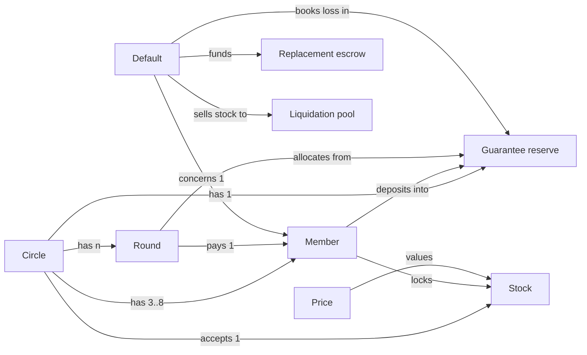
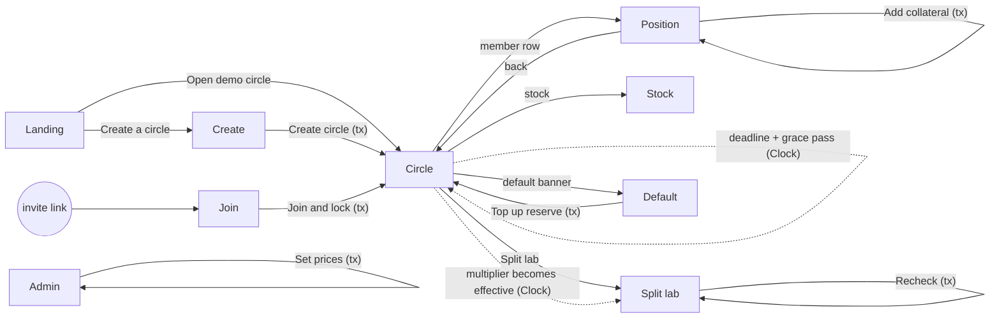
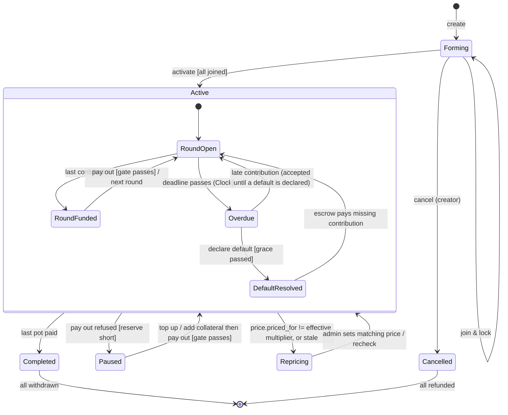
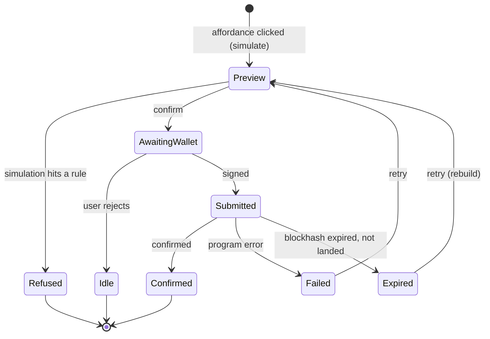

# Othello Blueprint

::masthead:: **Frozen design, 2026-09-21.** This is what Othello is meant to be. It is prescriptive: the build follows it, and when the build proves it wrong, the design changes here first. The Atlas describes what actually exists.

## 0. The premise

::stamp:: owner: joshua · frozen: 2026-09-21 · verified_by: four independent adversarial reviews (fable), final verdict implementation-ready

**The failure it fixes.** In an ajo, someone collects the pot early, then stops paying. The others have only their word.

**One sentence.** It's an ajo where everyone locks some stock as a promise, so if someone takes the pot and disappears, their stock pays for them.

**Four visible pieces.** **Circle** (who, how much, turn order) · **Locked stock** (your own cover, valued conservatively) · **Guarantee reserve** (everyone's equal deposit, covers what stock can't) · **Default** (what happens when someone stops, shown step by step).

**Why Solana.** Tokenized stocks use Token-2022's Scaled UI Amount: the displayed balance changes on a split while the raw amount doesn't. Othello reads the multiplier on-chain, so a split can't fool it. A vault that trusts the display gets fooled. That's the handkerchief test.

**Constraints.** Devnet only · $0 · solo · submissions close Fri 25 Sep 21:00 Lagos · neubrutalist UI.

## 1. Objects and who can touch them

### 2.1 Objects

| Object | One line | Core content | Metadata |
|---|---|---|---|
| **Circle** | A closed group with a contribution schedule | members + turn order, contribution amount, round length, grace, haircut, coverage target, guarantee per member, status | creator, created_at, current round |
| **Member** | One wallet's seat in one circle | wallet, turn number, collateral (raw), guarantee deposited, contributions paid, owed (O), status | joined_at, last health check |
| **Round** | One contribution period ending in one payout | index, recipient, deadline, contributions received, pot status | paid_at |
| **Guarantee reserve** | The pooled guarantee deposits | total, allocated, lost, free (derived) | per-member allocation |
| **Default** | The record of one member failing | member, round, obligation, recovered, reserve loss, escrow funded | declared_by, declared_at |
| **Replacement escrow** | USDC that pays a defaulter's future contributions | balance, rounds covered | |
| **Stock** (mock xStock mint) | A tokenized share with a scaled multiplier | mint, multiplier, new multiplier, effective time, issuer powers | symbol, decimals |
| **Price** (mock oracle) | The two prices Othello values stock at | wrapper price, share price, priced-for multiplier, updated_at | |
| **Liquidation pool** (mock) | Devnet stand-in for selling seized stock | USDC balance, price rule | |

Synonyms removed: "seat" and "participant" are **Member**. "Pot" is a property of Round, not an object. "Health" is a derived value of Member, not an object. "Vault" is an implementation detail.




### 2.4 CTA matrix

Roles: **Creator**, **Member**, **Anyone** (any wallet, including a keeper script), **Demo admin** (devnet key), **Viewer** (anonymous, no wallet), **System** (the Clock; Solana has no cron, so System only makes things *eligible*, a signer still sends the tx). **Agent**: none in scope.

| Object | Creator | Member | Anyone | Demo admin | Viewer |
|---|---|---|---|---|---|
| Circle | create (names members + order), activate, cancel (before activation only) | view | view, recheck | | view |
| Member (own) | | join & lock, add collateral, contribute, withdraw at end | recheck | | view |
| Round | | contribute (own) | pay out (when funded and gate passes) | | view |
| Reserve | | top up | | | view |
| Default | | | declare (after deadline + grace, Clock-verified) | | view |
| Stock | | | | schedule multiplier change (split) | view detail |
| Price | | | | set prices + priced-for multiplier | view |
| Pool | | | | seed | view |

Bounds for non-human roles:
- **Anyone** can only trigger transitions the program already allows by rule. No value moves to the caller. Bound: zero funds to caller, per call.
- **Demo admin** can move prices and the multiplier, never member funds. Bound: price, pool and mint authority on devnet only; no instruction takes a member's tokens on admin signature.

**DECISION D2.** The demo admin is a single devnet keypair, labelled "Demo admin" everywhere it appears. The UI states that on mainnet prices would come from an oracle and the multiplier from the issuer.

**DECISION D3.** Creator names every member wallet and the turn order at create. Joining is the member's approval: the join transaction shows turn, contribution, max loss and requires signature. Deletes: open join, a separate approval instruction, and order voting.

**DECISION D4.** Pay out is callable by **Anyone** once the round is fully funded. The recipient does not have to be online. Deletes the "recipient must claim" branch.


## 2. Words

| Term | Means | Never say |
|

## 3. Journeys

| # | Journey | Why critical |
|---|---|---|
| J1 | Set up a circle | every circle starts here; funds locked |
| J2 | Run a round | most frequent; the pot moves |
| J3 | Handle a default | the whole reason the product exists |
| J4 | Survive a split | the moat; the "handkerchief" demo |
| J5 | Finish and withdraw | funds come back; forgotten by the spec |

Plus the zero-wallet path J0 for the judge (view the demo circle), which is a property of every place's Viewer state rather than its own journey.


### Where you can go, and what takes you there



### How a circle lives



### How every transaction lives



## 4. The money rules

### Valuation

```
FUND = floor( raw x multiplier_fixed x share_price / (1e9 x 1e8) )     // what the shares are worth
EXEC = floor( raw x wrapper_price / 1e8 )                              // what the token sells for
H    = floor( min(FUND, EXEC) x (1 - haircut) )                         // stock cover
O    = contribution x rounds still owed                                 // only after receiving
need = max(0, ceil(O x coverage) - H)                                  // reserve required
```

The multiplier is decoded bit-exactly from the mint's f64 and rounded down. Collateral rounds down, obligations round up. A price only counts if it was stamped for the multiplier in force (ADR-005, ADR-010).

**Payout gate** (release_pot, recipient r = members[round]; r2 rewrite, option B):
1. Treat r as received after payout. For every received, non-defaulted member compute `need_i`. `S = Σ need_i`. `avail = reserve_total − reserve_losses`.
2. If `S ≤ avail`: set `reserve_allocated = S`, pay.
3. Else refuse. Both payloads carry `{needed: S, remaining: avail, short_by: S − avail + escrow_deficit, recipient_gap: need_r, others_need: S − need_r, escrow_deficit}` plus `recipient_cover: H_r`, so copy can name who can fix it and by how much (top-ups fill the escrow deficit first, hence `+ escrow_deficit`).
   - `coverage_too_low` **iff `H_r < min_stock_cover` AND `S − need_r ≤ avail`** (the recipient's own stock is below the join minimum and is the whole problem; copy leads with "lock more stock").
   - otherwise `reserve_overcommitted` (this is **Paused**; copy leads with "top up").

The gate is the only place the uncapped sum is compared. Everywhere else `reserve_allocated` is the capped, turn-order-distributed figure. **Paused** is defined on-chain as `next_gate_short_by > 0`; the UI never computes it. **It is as of the last update_coverage / release_pot / declare_default / top_up_reserve; add_stock and price changes do not refresh it.** The UI shows the last-checked age next to Paused and never disables Release pot on it: the program refuses with numbers if the gate fails (r4). Copy distinguishes **"free"** (R − L − reserve_allocated, the Guarantee panel) from **"remains"** (R − L, the gate's `remaining`).


### Default waterfall

```
d = defaulted member
O = contribution x (n - rounds_paid_d)                     // includes the missed round
conservative = wrapper_price x (10000 - pool.discount_bps) / 10000
sell_raw = min(stock_raw_d, ceil(u128(O) x 1e8 / conservative))  // u128; seize only what is owed (I9)
recovered = floor(sell_raw x conservative / 1e8)            // may exceed O by < 1 raw unit's value
require pool_usdc_vault >= recovered else pool_insufficient
stock: circle vault -> pool vault (sell_raw); usdc: pool vault -> circle vault (recovered)
funded_from_stock = min(O, recovered)                       // excess (< 1 raw unit) is vault dust
shortfall = O - funded_from_stock
loss = min(shortfall, reserve_total - reserve_losses)
reserve_losses += loss
escrow += funded_from_stock + loss
escrow_deficit += shortfall - loss                          // cured by top_up_reserve (section 5)
forfeited_d = min(shortfall, guarantee_d + top_ups_d)       // r3: measured against the shortfall, not the booked loss
forfeited_total += (new forfeited_d - old forfeited_d)
defaulted bit set; allocated_d = 0; stock_raw_d -= sell_raw (surplus returned at withdraw)
recompute allocations (capped); UI shows Paused if the next payout's gate sum > available
```

Liquidation uses the **non-scaled wrapper price only** (SPEC 1), so it works during Repricing. Staleness still applies.

**Coverage-based default (SPEC 5 "critical past the cure window") is cut** (r2). The only default trigger is a missed contribution. A member whose stock cover falls keeps paying and is not liquidated; the risk lands on the reserve at the next gate. Recorded in KNOWN-LIMITS; SPEC 5's sentence is superseded.


### Withdraw

```
precondition: Completed or Cancelled, not withdrawn
if Cancelled: usdc_i = guarantee_i + top_ups_i; stock back
if Completed (snapshot values, never decremented by withdraw):
  pool_left = reserve_total - reserve_losses + escrow            // escrow is always 0 at Completed (release refuses otherwise); kept for I3
  weight_i  = guarantee_i + top_ups_i - forfeited_i
  usdc_i    = floor( pool_left x weight_i / (deposits_total - forfeited_total) )   // u128; no remaining_accounts needed
  stock back: stock_raw_i (after any seizure)
withdrawn_usdc += usdc_i; withdrawn bit set; stock_raw_i = 0 (keeps I4 true)
```
Withdraw never changes reserve_total, reserve_losses or escrow, so every member's share is order-independent. Rounding dust stays in the vault. Member accounts are not closed in the prototype (rent stays locked; limit). Circle fields at Completed (paid_bitmap, round, reserve_allocated) are left as they are.

**No exit from Active without a successful payout** (r2, accepted limit): an Active circle whose gate cannot pass and that nobody tops up never completes. The create-time peak check makes this unreachable without a default or a price fall. No `dissolve` instruction in Tier 1.


### The demo circle

n=5, c=50 USDC, **g=35 USDC** (reserve 175 vs peak need 150: 25 of slack so one base unit of price drift cannot pause the demo), haircut 2000, coverage 13000, warn 11000, min_stock_cover 120 USDC, pool discount 2000, round 120 s, grace 60 s, max_price_age 691,200 s (8 days, through judging on 2 Oct; the UI shows the age). Mock prices before the split: wrapper 150, share 150, multiplier 1.0. Each member locks **1.1 token** → EXEC = FUND = 165, H = 132. All members join **before** the split is scheduled (join refuses during Repricing). Split: script schedules newMultiplier 10.0, then `set_prices(wrapper 150, share 15, Scheduled, expected 10_000_000_000)`; after the effective time H is unchanged at 132. `scripts/touch-prices.ts` calls `touch_prices` only; run it at submission (Fri 21:00 Lagos), which covers judging to 2 Oct 21:00 with the 8-day window.


## 5. What must never break

| # | Invariant | Checked by |
|---|---|---|
| I1 | `release_pot` succeeds **iff** Σ need_i ≤ reserve_total − reserve_losses, and refuses otherwise with the numbers. (Per-member `(H+G)·1e4 ≥ O·cov` follows.) | unit: one passing and one refusing case per code + property test |
| I2 | `reserve_allocated ≤ reserve_total − reserve_losses` and `Σ Member.allocated = Circle.reserve_allocated` after every instruction | property test after every ix, incl. declare_default during Repricing |
| I3 | usdc vault balance = `reserve_total − reserve_losses + escrow + held_contributions − withdrawn_usdc` (+ dust) | test after every ix in the scenario suite |
| I4 | stock vault balance = Σ member.stock_raw | same |
| I5 | `mult_fixed = floor(true_value × 1e9)` exactly; vectors 1002664207, 1003269012; NaN/Inf/negative rejected | unit (gate 1) |
| I6 | Pot released only when every seat is paid or escrow-covered | unit |
| I7 | `declare_default` only when `clock.unix_timestamp > deadline + grace`, and a seat is never defaultable less than `round_secs + grace` after its round opened | unit with Clock warp, incl. a late `release_pot` |
| I8 | No instruction moves a member's tokens on the admin's signature alone | review + negative test per admin ix |
| I9 | Seized stock value at the conservative price ≤ O + one raw unit | unit |
| I10 | Each member receives the pot exactly once; exactly n payouts per circle | unit |
| I11 | Σ withdrawals ≤ Σ deposits − reserve_losses | scenario test |
| I12 | 10-for-1 split with price updated for multiplier 10: H unchanged within 1 base unit | unit (gate 1) |
| I13 | Price stamped for a different multiplier than the effective one: `release_pot`, `update_coverage`, `join_and_lock` refuse; `declare_default` still works | unit |
| I14 | Escrow deficit is curable: default with shortfall > reserve, then a top-up of `next_gate_short_by` (which already includes the deficit) lets the circle complete | scenario test (G3) |
| I15 | A defaulter's withdraw weight excludes what their own default consumed | unit (G3) |
| I16 | Withdraw order does not change any member's amount | property test over permutations (G2) |
| I17 | `set_prices` never binds a share price to a multiplier the script did not name; `touch_prices` never changes prices or stamp | unit (G1): Scheduled stamp then Current with old share price before T → refused |
| I18 | Paused ⇔ `next_gate_short_by > 0`; a top-up of exactly `short_by` makes the next gate pass (if the round is funded); **no Paused after a healthy payout** (demo circle, every round) | scenario test (G3) |


## 6. Build order

| Gate | Scope | Done when |
|---|---|---|
| G1 spike (go / no-go) | valuation adapter: decode, Clock select, price feed, quote | decode vectors, split preserves value (I5, I12, I13, I17) |
| G2 circle core | create, join, activate, contribute, release, update coverage, withdraw | I1-I4, I6, I10, I11, I16; SPEC §3 peak table reproduced |
| G3 defaults | pool, waterfall, escrow, top-up, add stock | I7, I9, I14, I15, I18; SPEC §7 halt: 75 needed, 70 remains, short 5 |
| G4 frontend | every place and state from the flows, split lab, live stock view | every state renders; one-person UX test |
| G5 demo | devnet deploy, seed, seven-step demo, video, submit | link live before Fri 21:00 Lagos |

Every gate: Claude Code builds, Codex reviews, verdict recorded in DONE.md before the next gate.

## 7. Refusals people will see

| Trigger | Plain language | Why (if actionable) | Next action | Container | Machine |
|---|---|---|---|---|---|
| Payout gate: coverage | Can't release {name}'s pot. Their locked stock counts for {recipient_cover} USDC of cover, below the {min} minimum, and the reserve is {short_by} short. | the recipient's stock is the whole gap | Lock more stock (or any member tops up {short_by}) | inline, refusal style | `coverage_too_low` · suggest `add_stock` / `top_up_reserve` |
| Payout gate: reserve | Payouts paused. The next payout needs {needed} USDC of reserve and {remaining} remains. (If needed is 0 and a deficit exists, use the escrow-short wording.) | | Top up {short_by} USDC (returned pro rata at the end, minus any default losses) | banner, refusal | `reserve_overcommitted` · suggest `top_up_reserve` |
| Round not funded | {k} contributions still missing | | Wait, or remind them | inline | `round_not_funded` |
| Round not funded: escrow short | Round can't be released: {name}'s prepaid contributions ran {deficit} USDC short. | | Any member tops up {short_by} USDC; the first {deficit} prepays {name}'s contributions and is not returned | banner | `round_not_funded` with escrow_deficit > 0 · suggest `top_up_reserve` |
| Circle not active | This circle isn't running right now ({status}) | | View circle | inline | `circle_not_active` |
| Already withdrawn | You've already withdrawn from this circle | | none | inline | `already_withdrawn` |
| Not demo admin | Only the demo admin can do this | | none | inline | `unauthorized` |
| Repricing | Repricing. Price and split disagree. | payouts wait | Admin sets price; recheck | banner, neutral | `multiplier_price_mismatch` · suggest `recheck` after price update |
| Stale price | Prices are {age} old | | Recheck after update | banner, neutral | `price_stale` |
| Bad multiplier | This stock's multiplier can't be read safely | NaN, negative or malformed | None: asset ineligible | banner, error | `multiplier_invalid` |
| Declare too early | Grace ends in {t} | | Wait | inline refusal | `grace_not_elapsed` |
| Not member / wrong wallet | This invite is for {addr}. You're connected as {addr2}. | | Switch wallet | inline | `not_a_member` |
| Already contributed | You've paid this round | | none (button hidden) | n/a | `already_contributed` |
| Low balance | You need {x} more {token} | | Get devnet tokens (faucet link) | inline | `insufficient_balance` |
| Below collateral minimum | You need stock worth {x} USDC of cover to join | | Add more stock | inline | `collateral_below_minimum` |
| Circle closed | This circle already started | | View circle | page | `circle_not_forming` |
| Seat already paid | {name} has paid this round, so there's nothing to default | | none | inline refusal | `seat_already_paid` |
| Pre-payout default | {name} hasn't had their turn yet. Othello can't default a member before their turn; they can still pay late. | | Remind them | inline refusal | `pre_payout_default_unsupported` |
| Already defaulted | {name}'s default is already settled | | View default | inline | `already_defaulted` |
| Pool short (demo) | The demo liquidation pool needs refilling before this default can settle | | Demo admin: seed pool | banner | `pool_insufficient` · suggest `seed_pool` |
| Not everyone joined | Waiting for {names} to join | | Share their invite links | inline refusal | `not_all_joined` |
| Guarantee too small | Each member's guarantee must be at least {x} USDC so the reserve covers the busiest round | peak need {peak} USDC | Raise the guarantee | inline, on the field | `guarantee_below_peak_need` |
| Invalid settings | {field} must be {rule} | | Fix the field | inline, on the field | `invalid_params` |
| Not finished | You can withdraw when the circle ends | | none | inline | `not_finished` |
| Wallet rejected | You cancelled in your wallet. Nothing was sent. | | Try again | toast, neutral | client only |
| Tx expired | That transaction didn't land. Nothing changed. | | Try again | toast | client only |
| Mainnet data unavailable | Live AAPLx data unavailable right now | | Retry | inline in Stock | client only |

Refusals (coverage, reserve, grace, repricing) use neutral styling with the numbers; only `multiplier_invalid`, tx failures and fetch failures use error styling.

---


## 8. Accepted limits

Devnet only, one admin key for prices · single-key upgrade authority · pre-payout default unsupported · no exit from an active circle without a successful payout · coverage-based default cut · dust stays in vaults · real xStock issuer powers out of scope · one stock per circle · no keeper · Paused is as of the last check · top-ups that fill a defaulter's shortfall are not returned. Full table: KNOWN-LIMITS.md.
