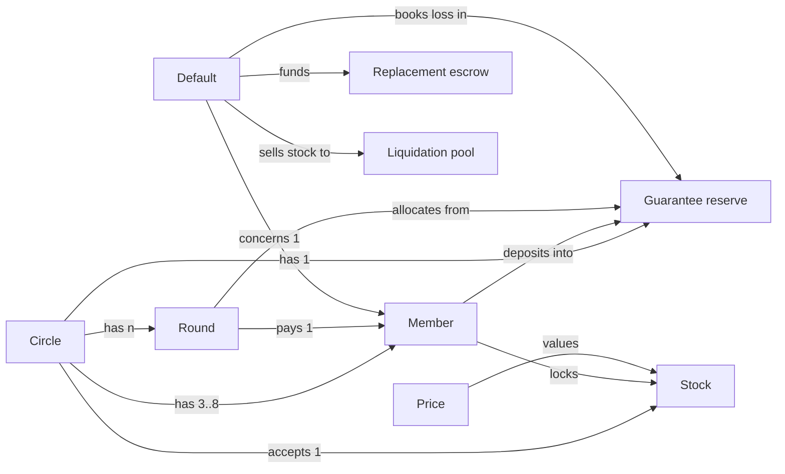
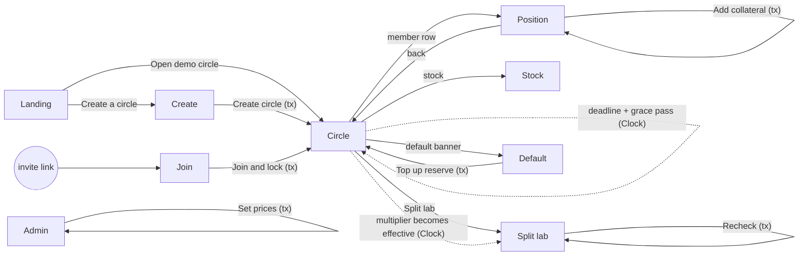
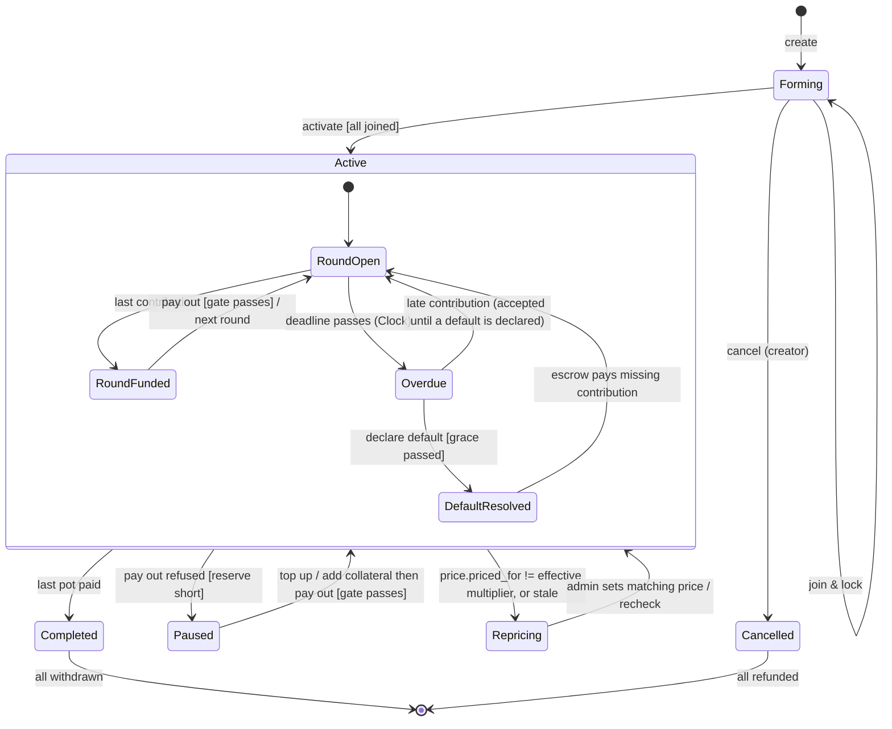
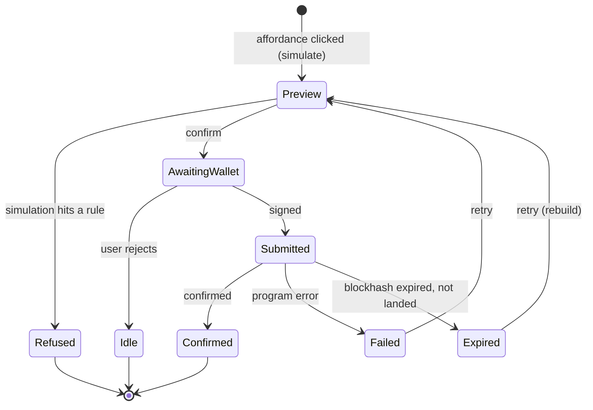

# Othello: flow design (Tier 1)

Inputs: `FRAME.md`, `../../SPEC.md` (v4). Date 2026-09-21. No layout in this document.
Decisions that close the gaps listed in FRAME 6b/6c are marked **DECISION** and feed stage 3.

---

## 1. Frame

**Problem.** Rotating savings circles break when an early recipient takes the pot and stops paying. Today the only protection is reputation. Holders of tokenized stocks have real assets they don't want to sell, and nothing lets them pledge those assets to a circle. Solved: members get the pot early without selling stock, and every member can check at any moment that each obligation is covered.

**Appetite.** ~2.5 working days, solo, $0. Spike first.

**No-gos.** Everything in SPEC "CUT", plus: open join, pre-payout dropout, keeper rewards, mainnet, "removed from future circles" (see D9).

**Context scenario, member (Tunde).** Tunde and four friends have run an ajo for two years. Last year one of them collected in month two and vanished. Tunde holds some Apple and Nvidia exposure as tokenized stock. This year the group wants the circle again, but nobody wants to be the one trusting. Tunde would put up his stock as a promise, as long as he keeps the exposure and gets it back when the circle ends, and as long as he can see the others did the same.

**Context scenario, judge.** A judge has five minutes and fifty entries. They want to see a real problem, the product working end to end, and a reason it needs Solana. They will not connect a wallet.

---

## 2. Object model

### 2.1 Objects

| Object | One line | Core content | Metadata |
|---|---|---|---|
| **Circle** | A closed group with a contribution schedule | members + turn order, contribution amount, round length, grace, haircut, coverage target, guarantee per member, status | creator, created_at, current round |
| **Member** | One wallet's seat in one circle | wallet, turn number, collateral (raw), guarantee deposited, contributions paid, owed (O), status | joined_at, last health check |
| **Round** | One contribution period ending in one payout | index, recipient, deadline, contributions received, pot status | paid_at |
| **Guarantee reserve** | The pooled guarantee deposits | total, allocated, lost, free (derived) | per-member allocation |
| **Default** | The record of one member failing | member, round, obligation, recovered, reserve loss, escrow funded | declared_by, declared_at |
| **Replacement escrow** | USDC that pays a defaulter's future contributions | balance, rounds covered | |
| **Stock** (mock xStock mint) | A tokenized share with a scaled multiplier | mint, multiplier, new multiplier, effective time, issuer powers | symbol, decimals |
| **Price** (mock oracle) | The two prices Othello values stock at | wrapper price, share price, priced-for multiplier, updated_at | |
| **Liquidation pool** (mock) | Devnet stand-in for selling seized stock | USDC balance, price rule | |

Synonyms removed: "seat" and "participant" are **Member**. "Pot" is a property of Round, not an object. "Health" is a derived value of Member, not an object. "Vault" is an implementation detail.

### 2.2 Nested object matrix

| | Circle | Member | Round | Reserve | Default | Escrow | Stock |
|---|---|---|---|---|---|---|---|
| **Circle** | | has 3..8 | has n (= members) | has 1 | has 0..n | has 0..1 | accepts 1 |
| **Member** | belongs to 1 | | receives in 1; pays into n | deposits into 1 | has 0..1 | funded for 0..1 | locks 1 kind |
| **Round** | belongs to 1 | pays 1 recipient | | draws allocation from 1 | may trigger 0..1 | | |
| **Default** | belongs to 1 | concerns 1 | declared in 1 | books loss in 1 | | funds 1 | seizes 1 |

**DECISION D1.** One stock per circle (the demo uses one mock AAPLx). Multi-asset collateral is cut.

### 2.3 Object graph

Reading: **Reserve** is the object everything points at, so its four fields are the product's centre of gravity. **Price** points in but nothing points to it: its only writer is the demo admin, which is the trust assumption to state (D2).

### 2.4 CTA matrix

Roles: **Creator**, **Member**, **Anyone** (any wallet, including a keeper script), **Demo admin** (devnet key), **Viewer** (anonymous, no wallet), **System** (the Clock; Solana has no cron, so System only makes things *eligible*, a signer still sends the tx). **Agent**: none in scope.

| Object | Creator | Member | Anyone | Demo admin | Viewer |
|---|---|---|---|---|---|
| Circle | create (names members + order), activate, cancel (before activation only) | view | view, recheck | | view |
| Member (own) | | join & lock, add collateral, contribute, withdraw at end | recheck | | view |
| Round | | contribute (own) | pay out (when funded and gate passes) | | view |
| Reserve | | top up | | | view |
| Default | | | declare (after deadline + grace, Clock-verified) | | view |
| Stock | | | | schedule multiplier change (split) | view detail |
| Price | | | | set prices + priced-for multiplier | view |
| Pool | | | | seed | view |

Bounds for non-human roles:
- **Anyone** can only trigger transitions the program already allows by rule. No value moves to the caller. Bound: zero funds to caller, per call.
- **Demo admin** can move prices and the multiplier, never member funds. Bound: price, pool and mint authority on devnet only; no instruction takes a member's tokens on admin signature.

**DECISION D2.** The demo admin is a single devnet keypair, labelled "Demo admin" everywhere it appears. The UI states that on mainnet prices would come from an oracle and the multiplier from the issuer.

**DECISION D3.** Creator names every member wallet and the turn order at create. Joining is the member's approval: the join transaction shows turn, contribution, max loss and requires signature. Deletes: open join, a separate approval instruction, and order voting.

**DECISION D4.** Pay out is callable by **Anyone** once the round is fully funded. The recipient does not have to be online. Deletes the "recipient must claim" branch.

### 2.5 Vocabulary

| Term | Means | Never say |
|---|---|---|
| Circle | the group and its schedule | pool, vault, group |
| Round | one period ending in one payout | epoch, cycle |
| Pot | the USDC paid out in a round | payout amount |
| Turn | the round in which a member receives the pot | slot, position |
| Contribution | one member's payment into one round | deposit, instalment |
| Owed | contributions a member still has to make after receiving (O) | debt, loan |
| Locked stock | the stock a member has pledged (muted: collateral) | collateral (surface) |
| Stock cover | counted value of locked stock (H) | collateral value, LTV |
| Reserve cover | guarantee reserve allocated to a member (G) | insurance |
| Coverage | (stock cover + reserve cover) / owed | health factor |
| Healthy / Warning / Critical | coverage ≥ the circle's target (demo 130%) / ≥ warn (demo 110%) / below warn | safe, risky |
| Guarantee reserve | everyone's equal guarantee deposits: Free, Allocated, Lost | insurance fund |
| Update coverage | recompute coverage now (muted: refresh_health) | recheck, refresh, sync |
| Default | a missed contribution past grace, declared on-chain | liquidation (that is one step inside default) |
| Paused | the next payout can't be released, or a defaulter's prepaid contributions will run short (on-chain `next_gate_short_by > 0`, as of the last check) | halted, frozen |
| Repricing | valuation paused because price and multiplier disagree (D5) | stale, error |
| Split | the stock's multiplier changes; your raw amount does not | rebase |

---

## 3. Critical journeys

Scored frequency x reach x consequence (consequence weighted for funds). Top five:

| # | Journey | Why critical |
|---|---|---|
| J1 | Set up a circle | every circle starts here; funds locked |
| J2 | Run a round | most frequent; the pot moves |
| J3 | Handle a default | the whole reason the product exists |
| J4 | Survive a split | the moat; the "handkerchief" demo |
| J5 | Finish and withdraw | funds come back; forgotten by the spec |

Plus the zero-wallet path J0 for the judge (view the demo circle), which is a property of every place's Viewer state rather than its own journey.

**J1 Set up a circle.** User: Creator, knows the four wallets. Goal: "a circle where nobody has to trust anybody". Tasks: create (tx) → each member joins & locks (tx each) → activate (tx). Events: `circle_create_submitted/confirmed`, `member_join_submitted/confirmed`, `circle_activate_submitted/confirmed`; success `circle_activated`; abandon 24h without all joins.

**J2 Run a round.** User: Member. Goal: "pay my share, and whoever's turn it is gets paid, only if everyone stays covered". Tasks: contribute (tx) → last contribution lands → anyone pays out (tx, gated). Events: `contribute_submitted/confirmed`, `payout_submitted/confirmed/refused{reason}`; success `pot_paid`.

**J3 Handle a default.** User: Anyone after grace. Goal: "the circle keeps going, or says clearly why it can't". Tasks: deadline + grace pass → declare default (tx) → waterfall runs in the same tx → circle continues or is Paused → a member tops up (tx) → payouts resume. Events: `default_declared_confirmed`, `circle_paused`, `reserve_topup_confirmed`, `circle_resumed`.

**J4 Survive a split.** User: Demo admin + Viewer. Goal: "prove the collateral is valued correctly when the token's display changes". Tasks: admin schedules multiplier 1→10 and sets share price $1,000→$100 with priced-for = 10 → effective time passes → anyone rechecks → split lab shows naive vs Othello. Events: `split_scheduled`, `recheck_confirmed`, `split_lab_viewed`.

**J5 Finish and withdraw.** User: Member. Goal: "get my stock and unused guarantee back". Tasks: last pot paid → circle Completed → withdraw (tx). Events: `withdraw_submitted/confirmed`; abandon: funds unclaimed 7 days (shown, not enforced).

---

## 4. Breadboards

Places are marked `[Place]`. Affordances follow, with their CTA cell in braces. Dashed = system-initiated.

### Places

- `[Landing]` premise, "Open demo circle" {Viewer: view Circle}, "Create a circle" {Creator: create}
- `[Create]` members + order, contribution, round length, grace, haircut, coverage target, guarantee (proposed from schedule), "Create circle" {Creator: create}
- `[Circle]` timeline, member table, reserve, "Update coverage" {Anyone: recheck}, "Contribute" {Member: contribute}, "Release pot" {Anyone: pay out}, "Declare default" {Anyone: declare}, "Top up reserve" {Member: top up}, "Activate" {Creator: activate}, "Cancel circle" {Creator: cancel}, "Withdraw" {Member: withdraw}, member row → `[Position]`, stock → `[Stock]`, default banner → `[Default]`, "Split lab" → `[Split lab]`
- `[Join]` (invite link) terms, turn, max loss, "Join and lock" {Member: join & lock}
- `[Position]` one member: raw, scaled, multiplier, prices, haircut, stock cover, reserve cover, owed, coverage, max loss, last checked, "Lock more stock" {Member: add collateral}
- `[Stock]` issuer powers, liquidity, eligibility, live mainnet price for the real AAPLx (display only) {Viewer: view detail}
- `[Default]` waterfall for one default, "Top up reserve" {Member: top up}
- `[Split lab]` naive vault vs Othello side by side, "Recheck" {Anyone}
- `[Admin]` (demo only) "Set prices" {Admin: set prices}, "Schedule split" {Admin: schedule}, "Seed pool" {Admin: seed}

### Breadboard diagram

Every place has a back to `[Circle]` or `[Landing]`. `[Admin]` is reachable only by URL and only renders controls for the admin key.

---

## 5. Affordance trace

| # | Place | Affordance | Trigger | Precondition | What changes | Resulting state | On failure | Lands in |
|---|---|---|---|---|---|---|---|---|
| 1 | Landing | Open demo circle | click | none (no wallet) | nothing | Circle: viewer | demo circle missing → "Demo is being reset" + retry | Circle |
| 2 | Create | Create circle | submit | wallet connected, 3-8 unique wallets, creator in list, every field valid | Circle account created (Forming) | Circle: forming | tx fails → keep form, show reason | Circle |
| 3 | Join | Join and lock | submit | wallet is named member, circle Forming, stock balance ≥ minimum, USDC ≥ guarantee | stock → vault, guarantee → reserve, member Joined | Circle: forming | wrong wallet / low balance → refusal copy | Circle |
| 4 | Circle | Activate | click | creator, circle Forming, all members Joined | status Active, round 1 opens, deadline set | Circle: round open | not all joined → refusal listing who | Circle |
| 5 | Circle | Cancel circle | click + confirm | creator, circle Forming | everything refunded, Cancelled | Circle: cancelled | tx fail → retry | Circle |
| 6 | Circle | Contribute | click | member, round open, not yet paid this round, USDC ≥ amount | contribution recorded | Circle: round open / funded | already paid → hidden; low USDC → refusal | Circle |
| 7 | Circle | Release pot | click | round funded (Paused is shown with its age but never disables this; the program decides) | gate passes: pot → recipient, allocations booked, next round opens | Circle: next round | refusal names the failing rule and the numbers | Circle |
| 8 | Circle | Recheck | click | circle Active | coverage recomputed for all members, last-checked stamped | same state, fresh | stale price → Repricing/Stale state | Circle |
| 9 | Circle | Declare default | click | deadline + grace passed (Clock), a contribution missing | waterfall runs (see J3) | Circle: active or paused | too early → refusal with time left | Default |
| 10 | Circle / Default | Top up reserve | submit amount | member, not defaulted, circle Active (incl. Paused) | fills any escrow deficit first, rest joins the reserve | Circle: active if next_gate_short_by reaches 0 | tx fail → keep amount | Circle |
| 11 | Position | Lock more stock | submit amount | own position, not defaulted, circle Forming (joined) or Active | raw += amount (coverage and Paused refresh on the next Update coverage) | Position: updated | low balance → refusal | Position |
| 12 | Circle | Withdraw | click | circle Completed or Cancelled, not yet withdrawn | stock returned; unused guarantee and top-ups pro rata by (guarantee + top-ups − forfeited) | Position: withdrawn | tx fail → retry | Circle |
| 13 | Split lab | Recheck | click | multiplier effective | as #8 | Split lab: after | as #8 | Split lab |
| 14 | Admin | Schedule split | submit | admin key | newMultiplier + effective time on mint | Admin: scheduled | not admin → hidden | Admin |
| 15 | Admin | Set prices | submit | admin key | wrapper price, share price, priced-for multiplier, updated_at | Admin: set | as #14 | Admin |
| 16 | Admin | Seed pool | submit | admin key | pool USDC += amount | Admin: seeded | as #14 | Admin |
| 17 | any | Connect wallet | click | none | session | place: connected | rejected → stay viewer | same |
| 18 | any | Browser back | back | none | nothing | previous place | mid-tx: tx continues; toast persists | previous |
| 19 | any | Refresh mid-tx | reload | tx submitted | nothing on-chain | place re-reads chain; pending sig re-polled from local storage | sig unknown → "Checking last transaction" then chain state | same |
| 20 | any | Deep link / shared link | open URL | none | nothing | Viewer state of that place | circle not found → Landing with message | place |
| 21 | Join | Expired invite | open URL | circle not Forming | nothing | Join: closed | "This circle already started" + view | Circle |
| 22 | any | Second tab | act in both | none | chain is source of truth | both re-read after confirm | double contribute refused by program | same |
| 23 | any | Narrow viewport | resize | none | member table collapses to one card per member (content order only, no layout decided here) | same | none | same |
| 24 | any | Wrong network | wallet on mainnet | none | actions disabled | place: wrong network | "Switch to devnet" | same |

---

## 6. Sample dialogs

**J2 happy path**
- Othello: "Round 2 of 5. Tunde's turn. 3 of 5 contributions in. Deadline in 1:42."
- Ada clicks Contribute. Othello: "Pay 50 USDC into round 2. This is a transaction and can't be undone." (why: sign vs transact stated before the wallet opens)
- Wallet confirms. Othello: "Paid. 4 of 5 in."
- Last contribution lands. Othello: "Round 2 is fully funded. Anyone can release the pot to Tunde; it's already collected."
- Pay out. Othello: "Tunde received 250 USDC. Round 3 opens. Tunde now owes 150 USDC over 3 rounds, covered 130%."

**J2 repair: payout refused**
- Othello (illustrative numbers): "Can't release Tunde's pot yet. His locked stock now counts for 95 USDC of cover, below the circle's 120 minimum, and the reserve is 56 USDC short. Tunde can lock more stock to release his pot. Or any member can top up 56 USDC. Top-ups join the shared reserve; what isn't used to cover defaults comes back pro rata when the circle ends." (code `coverage_too_low`: the recipient's own stock is below the minimum and is the whole gap)

**J3 default**
- Clock passes deadline. Othello: "Kemi hasn't paid round 3. Grace ends in 0:58."
- Grace passes. Othello: "Kemi's round 3 contribution is overdue. Anyone can declare the default."
- Declare. Othello: "Default declared. Kemi owed 150 USDC. Her stock sold for 112 USDC. The reserve covered 38 USDC, starting with Kemi's own deposit. Kemi already received her pot in round 1 and stopped paying; her last 3 contributions are now paid from that. Reserve free: 117 USDC." (demo circle, g = 35; next payout needs 20, not paused)
- **Paused variant (SPEC §7 numbers, reserve 150):** a default recovers 120 of 200 owed, the reserve covers 80, 70 remains, the next payout needs 75. "Payouts are paused. The next payout needs 75 USDC of reserve and 70 remains. Any member can top up 5 USDC to resume. Top-ups join the shared reserve; what isn't used to cover defaults comes back pro rata when the circle ends."

**J4 split**
- Admin schedules. Othello (banner): "AAPLx splits 10-for-1 at 14:05. Your raw amount won't change."
- After effective time, before recheck: "The split is live. Coverage was last checked before it. Update coverage to see it."
- Update coverage. Split lab: "Raw 1.10. Multiplier 10. Share price 15 USDC. Othello values it at 165 USDC, unchanged. A vault that ignores the multiplier thinks it's worth 16.50 USDC and would liquidate you."

**J4 repair: repricing**
- Price updated for multiplier 10, mint still at 1: "Repricing. The price assumes a split that hasn't happened yet. Releasing pots waits until they agree." Missed-payment defaults still work (a missed payment is a missed payment).

**J1 repair: wrong wallet at Join**
- "This invite is for 7xQ…a91. You're connected as 3Fp…c02. Switch wallet to join."

---

## 7. State inventory

### DECISION D5: repricing rule (closes FRAME 6c.1)
The price account stores `priced_for_multiplier`. Fundamental value is computed only when the mint's effective multiplier equals it. Otherwise the circle is **Repricing**: releasing a pot, updating coverage and joining refuse; declaring a missed-contribution default still works (liquidation uses the wrapper price only). The program stamps `priced_for_multiplier` itself from the mint when the admin sets prices (SYSTEM r2). Coverage-based defaults do not exist (cut, SYSTEM §6).

### DECISION D6: staleness
Price older than `max_price_age` (per circle; demo circle 8 days so judges never see a stale banner, age always shown) is **Stale**: same refusals as Repricing. The admin refresh script only touches the timestamp, never the prices (SYSTEM r3).

### DECISION D7: cure and recovery
`add_stock` ("Lock more stock") and `top_up_reserve` are the only cure and recovery actions. A top-up fills any escrow deficit first. A Paused circle (next_gate_short_by > 0) resumes on the next successful release; there is no separate resume instruction.

### DECISION D8: completion
`withdraw` per member after Completed or Cancelled: stock back (minus anything seized); unused guarantee and top-ups pro rata by (guarantee + top-ups − forfeited). A defaulter's own deposit absorbs their shortfall first (SYSTEM §6-7).

### DECISION D9: default consequence
Member status Defaulted is permanent in this circle and shown in the member table. The claim "removed from future circles" is cut (no cross-circle record in scope).

### DECISION D10: demo timescale
Round length and grace are circle parameters in seconds. Demo circle: 120 s rounds, 60 s grace.

### Per place (four axes)

| Place | Data | Async | Permission | Error |
|---|---|---|---|---|
| Landing | ideal only | demo circle loading | viewer / connected | demo missing (recoverable) |
| Create | empty form, partial, valid | submitting, confirming | needs wallet; wrong network | validation (inline), tx failed |
| Join | terms | submitting, confirming | named member / not named / not connected / wrong net | circle closed (terminal), low balance (refusal) |
| Circle | forming, active, paused, repricing, completed, cancelled | recheck/contribute/payout/declare/top-up in flight; awaiting others | viewer / member / creator / recipient / defaulter / admin; wrong net | tx failed, refusal, stale |
| Position | before join, locked, withdrawn | add-collateral in flight; last checked age | own / other / viewer | low balance |
| Stock | live, unavailable (mainnet fetch failed) | loading | viewer | fetch failed (recoverable, "live data unavailable") |
| Default | resolved-continuing, resolved-paused | top-up in flight | as Circle | tx failed |
| Split lab | before split, scheduled, effective-unchecked, after | recheck in flight | viewer / anyone | repricing, stale |
| Admin | ready | submitting | admin / not admin (renders nothing) | tx failed |

### Statechart: Circle

Every UI state has an exit. An Active circle whose gate cannot pass and that nobody tops up has none (accepted limit, SYSTEM §7). Repricing and Paused are orthogonal to the round sub-state in the program (Paused ⇔ next_gate_short_by > 0), drawn as siblings here for readability.

### Statechart: transaction (every tx affordance)

Solana has no replace/speed-up; "dropped" is Expired.

---

## 8. Copy and errors

### Copy per place

| Place | Heading | Primary CTA | Secondary | Helper | Empty | Success |
|---|---|---|---|---|---|---|
| Landing | Savings circles where nobody has to trust anybody | Open demo circle | Create a circle | Lock tokenized stock as a promise. You still own it. You get it back when the circle ends. | | |
| Create | New circle | Create circle | Cancel | You'll name every member and the order they get paid. Each member confirms when they join. | Add at least 3 members | Circle created. Share each member's invite link. |
| Join | You're invited to {circle} | Join and lock | View circle | Turn {n} of {N}. {amount} USDC per round. You lock {stock} and put {g} USDC into the circle's shared reserve. Both come back when the circle ends. Most you could lose: {g} USDC, only if others default and their stock doesn't cover it. | | You're in. Your stock is locked until the circle ends. |
| Circle | Round {r} of {N} · {name}'s turn | Contribute / Release pot to {name} (context) | Update coverage | Coverage uses prices from {age} ago | Waiting for {k} members to join | Pot paid |
| Position | {name}'s position | Lock more stock | Back | Counted at the lower of its market price and its share price, minus a {haircut}% safety margin | Not joined yet | Coverage now {pct}% |
| Default | {name} defaulted in round {r} | Top up reserve | Back to circle | Their remaining contributions are prepaid from their stock and the reserve. | | Payouts resumed |
| Split lab | What a stock split does to your locked stock (muted: the handkerchief test) | Update coverage | Back | Same stock, same value. One vault believes the display. | No split yet. The demo admin can schedule one. | |

### Errors and refusals (machine codes become Anchor error names)

| Trigger | Plain language | Why (if actionable) | Next action | Container | Machine |
|---|---|---|---|---|---|
| Payout gate: coverage | Can't release {name}'s pot. Their locked stock counts for {recipient_cover} USDC of cover, below the {min} minimum, and the reserve is {short_by} short. | the recipient's stock is the whole gap | Lock more stock (or any member tops up {short_by}) | inline, refusal style | `coverage_too_low` · suggest `add_stock` / `top_up_reserve` |
| Payout gate: reserve | Payouts paused. The next payout needs {needed} USDC of reserve and {remaining} remains. (If needed is 0 and a deficit exists, use the escrow-short wording.) | | Top up {short_by} USDC (returned pro rata at the end, minus any default losses) | banner, refusal | `reserve_overcommitted` · suggest `top_up_reserve` |
| Round not funded | {k} contributions still missing | | Wait, or remind them | inline | `round_not_funded` |
| Round not funded: escrow short | Round can't be released: {name}'s prepaid contributions ran {deficit} USDC short. | | Any member tops up {short_by} USDC; the first {deficit} prepays {name}'s contributions and is not returned | banner | `round_not_funded` with escrow_deficit > 0 · suggest `top_up_reserve` |
| Circle not active | This circle isn't running right now ({status}) | | View circle | inline | `circle_not_active` |
| Already withdrawn | You've already withdrawn from this circle | | none | inline | `already_withdrawn` |
| Not demo admin | Only the demo admin can do this | | none | inline | `unauthorized` |
| Repricing | Repricing. Price and split disagree. | payouts wait | Admin sets price; recheck | banner, neutral | `multiplier_price_mismatch` · suggest `recheck` after price update |
| Stale price | Prices are {age} old | | Recheck after update | banner, neutral | `price_stale` |
| Bad multiplier | This stock's multiplier can't be read safely | NaN, negative or malformed | None: asset ineligible | banner, error | `multiplier_invalid` |
| Declare too early | Grace ends in {t} | | Wait | inline refusal | `grace_not_elapsed` |
| Not member / wrong wallet | This invite is for {addr}. You're connected as {addr2}. | | Switch wallet | inline | `not_a_member` |
| Already contributed | You've paid this round | | none (button hidden) | n/a | `already_contributed` |
| Low balance | You need {x} more {token} | | Get devnet tokens (faucet link) | inline | `insufficient_balance` |
| Below collateral minimum | You need stock worth {x} USDC of cover to join | | Add more stock | inline | `collateral_below_minimum` |
| Circle closed | This circle already started | | View circle | page | `circle_not_forming` |
| Seat already paid | {name} has paid this round, so there's nothing to default | | none | inline refusal | `seat_already_paid` |
| Pre-payout default | {name} hasn't had their turn yet. Othello can't default a member before their turn; they can still pay late. | | Remind them | inline refusal | `pre_payout_default_unsupported` |
| Already defaulted | {name}'s default is already settled | | View default | inline | `already_defaulted` |
| Pool short (demo) | The demo liquidation pool needs refilling before this default can settle | | Demo admin: seed pool | banner | `pool_insufficient` · suggest `seed_pool` |
| Not everyone joined | Waiting for {names} to join | | Share their invite links | inline refusal | `not_all_joined` |
| Guarantee too small | Each member's guarantee must be at least {x} USDC so the reserve covers the busiest round | peak need {peak} USDC | Raise the guarantee | inline, on the field | `guarantee_below_peak_need` |
| Invalid settings | {field} must be {rule} | | Fix the field | inline, on the field | `invalid_params` |
| Not finished | You can withdraw when the circle ends | | none | inline | `not_finished` |
| Wallet rejected | You cancelled in your wallet. Nothing was sent. | | Try again | toast, neutral | client only |
| Tx expired | That transaction didn't land. Nothing changed. | | Try again | toast | client only |
| Mainnet data unavailable | Live AAPLx data unavailable right now | | Retry | inline in Stock | client only |

Refusals (coverage, reserve, grace, repricing) use neutral styling with the numbers; only `multiplier_invalid`, tx failures and fetch failures use error styling.

---

## 9. Heuristic review

- Status visible: last-checked age on every coverage number; tx lifecycle toasts; Paused and Repricing are banners. Pass.
- Vocabulary: all step names from 2.5. The word "liquidation" appears only inside the default waterfall. Pass.
- Control: every place has back; no modal traps. Cancel only while Forming. Pass.
- Prevention: D3 deletes open join and order voting; D4 deletes recipient-claim; Contribute hidden once paid; Admin controls not rendered for others. Pass.
- Recognition: Join restates turn, amount, max loss. Payout refusal restates the numbers. Pass.
- Minimalism: no separate approve-order step, no resume instruction. Pass.
- Recovery: every refusal names one action. Pass.
- Undo over confirm: only Cancel circle confirms ("Cancel circle and refund everyone"). Tx previews replace confirms. Pass.
- Forgiving formats: wallet addresses accepted with or without whitespace; amounts accept separators. Pass.
- Progressive disclosure: Position, Stock, Default, Split lab are sub-places of Circle. Pass.

Web3 checklist: reading needs no wallet (J0). Every tx previewed by simulation with the expected result. Sign vs transact stated (all actions are transactions; there are no free signatures). Wrong network and disconnected are ordinary states. No delegations exist. Pass.

---

## 10. Legibility

- **One sentence:** "It's an ajo where everyone locks some stock as a promise, so if someone takes the pot and disappears, their stock pays for them."
- **Time to first value:** judge: 1 click, 0 signatures (Open demo circle). Member: connect + 1 signature (Join and lock).
- **Onboarding** lives in the Forming empty state ("Waiting for 2 members to join: Kemi, Ada") and the Join helper text. No tutorial.
- **Developers:** README quickstart: clone, `anchor test` runs the spike tests (PodF64 vectors 1002664207 / 1003269012, split preserves value). One worked example per journey as a script in `scripts/` (create-demo-circle, run-round, trigger-default, schedule-split).
- **Agents:** out of scope; the machine error codes above are the tool contract if added later.

## Closing check

- [x] J1-J5 each have breadboard coverage, diagram edges and a dialog (J1 and J5 dialogs are short: create/join and withdraw are single-tx)
- [x] every affordance maps to a CTA cell
- [x] every affordance has a trace row with failure filled, incl. back, refresh, deep link, second tab, narrow viewport
- [x] non-human roles bounded (Anyone: no funds to caller; Admin: no member funds)
- [x] places run through four axes; Circle and transaction statecharts drawn, all states have exits
- [x] errors have human + machine copy; refusals distinguished
- [x] tx lifecycle includes expired
- [x] no layout
