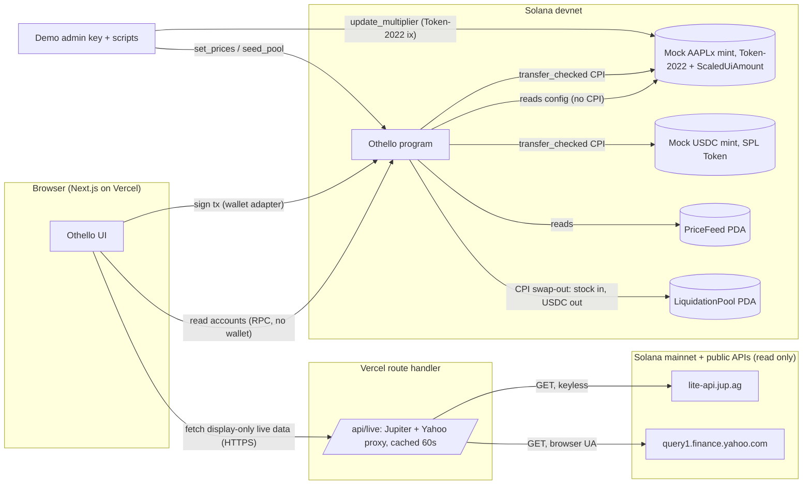

# Othello: system design (Tier 1)

Seeded by FRAME.md, FLOWS.md (D1-D10), UX-REVIEW.md, ../../SPEC.md v4. Date 2026-09-21.
Tier note: the system-design skill puts "holds money, handed to a builder" at Tier 2. This is Tier 1 by explicit choice (deadline, devnet mock funds only). Recorded in KNOWN-LIMITS.

Versions looked up 2026-09-21: `anchor-lang` 1.1.2 (docs.rs latest), `spl-token-2022-interface` 2.1.0 (docs.rs latest). **Compatibility of these two is unverified: gate 1 pins whatever `anchor-spl` 1.1.x resolves and records it.**

---

## 1. Goals, non-goals

**Goals (FR)**
- FR-1 Create a circle naming 3-8 wallets, turn order, contribution, round length, grace, haircut, coverage target, guarantee per member, minimum stock cover.
- FR-2 A named member joins by locking stock and depositing the guarantee in one transaction.
- FR-3 Creator activates when all joined; cancels (full refund) while Forming.
- FR-4 Members contribute each round; anyone releases the pot when funded and the gate passes.
- FR-5 Anyone recomputes coverage (`update_coverage`).
- FR-6 Anyone declares a post-payout default after deadline + grace; the waterfall runs atomically.
- FR-7 Members add stock or top up the reserve at any time while Active.
- FR-8 After Completed or Cancelled, each member withdraws stock, unused guarantee and top-ups pro rata.
- FR-9 A read-only valuation quote shows raw, multiplier, both prices, both values, stock cover.
- FR-10 Demo admin sets prices and seeds the pool; a script schedules the mint's multiplier change.

**NFR (prioritised)**
1. NFR-1 Correctness of money maths: fixed-point only, rounding in the protocol's favour, checked u128. (functional correctness)
2. NFR-2 Every refusal carries the numbers the UI needs (needed vs have). (usability / interaction capability)
3. NFR-3 Every instruction fits in the default 200k CU with n = 8. ASSUMPTION, measured in gate 1 and gate 2.
4. NFR-4 Demo runs start to finish in under 6 minutes of wall time with 120 s rounds.

**Non-goals.** FRAME section 4 plus: multi-asset collateral (D1), open join (D3), cross-circle reputation (D9), keeper rewards, indexer.

---

## 2. Solution strategy

1. **Raw units on-chain, presentation at the edge.** Every value the program stores is raw token units or USDC base units. Multiplier becomes a fixed-point integer by exact IEEE-754 decode. The UI alone converts to scaled amounts. (Solana's own guidance: Scaled UI Amount is a presentation layer.)
2. **Pulled, not pushed.** No keeper. Every transition is an instruction someone signs, and the program checks time against the Clock sysvar. Coverage and allocations are recomputed from scratch inside every state-changing instruction, so there is no stale cached solvency to trust.
3. **Mocks behind two accounts.** `PriceFeed` and `LiquidationPool` are the only devnet-specific parts. Replacing them with a real oracle and a DEX route is an adapter change, not a redesign.

## 3. Architecture



**Trust boundaries:** wallet ↔ program (signature), admin ↔ PriceFeed/Pool/mint (admin signature; devnet only), server route ↔ public APIs (display only, never enters program state), browser ↔ server route (public, rate limited by cache).

**On/off-chain rule:** anything that decides who gets money is on-chain. Live mainnet data is display only (SPEC v4 note 3).

**Liquidation pool as instructions of the same program** (ADR-004): `LiquidationPool` is a PDA of the Othello program, not a separate program. Default seizes stock into the pool's stock vault and moves USDC from the pool vault to the circle vault inside one instruction. No cross-program swap.

## 4. Data (Anchor account layouts, specification only)

Units: `usdc` = 6-dp base units. `raw` = 8-dp stock base units. Prices = USDC base units per **1 whole token** (10^8 raw). Multiplier fixed = ×1e9.

```rust
#[account] pub struct Circle {            // seeds ["circle", creator, circle_id.to_le_bytes()]
  pub creator: Pubkey, pub circle_id: u64, pub bump: u8,
  pub stock_mint: Pubkey, pub usdc_mint: Pubkey, pub price_feed: Pubkey, pub pool: Pubkey,
  pub n: u8,                               // 3..=8
  pub members: [Pubkey; 8],                // index = turn (0-based); unused = default
  pub contribution: u64,                   // usdc per member per round
  pub round_secs: i64, pub grace_secs: i64,
  pub haircut_bps: u16,                    // e.g. 2000 = 20% off
  pub coverage_bps: u16,                   // 13000 on the demo circle (SPEC 3 table)
  pub warn_bps: u16,                       // 11000
  pub guarantee_per_member: u64,           // usdc
  pub min_stock_cover: u64,                // usdc, checked at join
  pub max_price_age: i64,                  // demo circle: 691_200 (8 days, covers judging to 2 Oct)
  pub status: CircleStatus,                // Forming | Active | Completed | Cancelled
  pub round: u8,                           // 0-based current round
  pub round_deadline: i64,
  pub paid_bitmap: u8,                     // contributions received this round
  pub joined_bitmap: u8, pub withdrawn_bitmap: u8, pub received_bitmap: u8, pub defaulted_bitmap: u8,
  pub reserve_total: u64, pub reserve_losses: u64, pub reserve_allocated: u64,
  pub escrow: u64,                         // replacement escrow (usdc)
  pub escrow_deficit: u64,                 // O not fundable at default time (r2, CRIT-1)
  pub withdrawn_usdc: u64,                 // cumulative paid out by withdraw (r2, I3)
  pub deposits_total: u64,                 // Σ guarantee + top-ups ever deposited (r3)
  pub forfeited_total: u64,                // Σ Member.forfeited (r3)
  pub next_gate_short_by: u64,             // > 0 means Paused (r3); see §5
  pub held_contributions: u64,             // this round's contributions not yet released
  pub last_coverage_at: i64,
}
#[account] pub struct Member {             // seeds ["member", circle, wallet]
  pub circle: Pubkey, pub wallet: Pubkey, pub turn: u8, pub bump: u8,
  pub stock_raw: u64, pub guarantee: u64, pub top_ups: u64,
  pub forfeited: u64,                      // own guarantee+top-ups consumed by own default (r2)
  pub rounds_paid: u8,                     // including escrow-paid
  pub allocated: u64,                      // G_i, last recompute; 0 once defaulted
  pub last_coverage_bps: u32,              // saturating; u32::MAX when O_i = 0 or member is defaulted (obligations prepaid)
}
#[account] pub struct PriceFeed {          // seeds ["price", stock_mint]
  pub authority: Pubkey, pub bump: u8,
  pub wrapper_price: u64,                  // NON-SCALED price of 1 whole raw token
  pub share_price: u64,                    // price of 1 underlying share
  pub priced_for_multiplier: u64,          // fixed 1e9; D5
  pub updated_at: i64,
}
#[account] pub struct LiquidationPool {    // seeds ["pool", usdc_mint, stock_mint]
  pub authority: Pubkey, pub bump: u8,
  pub discount_bps: u16,                   // conservative sale price = wrapper_price x (1 - discount)
}
```
Token accounts, all PDA-owned: `circle_stock_vault` (Token-2022), `circle_usdc_vault` (SPL), `pool_stock_vault`, `pool_usdc_vault`.

Derived, never stored as truth: `O_i`, `H_i`, required `G_i`, `reserve_free`.

```
O_i  = received_i ? contribution x (n - rounds_paid_i) : 0            // round UP (already integer)
FUND = floor( raw x mult_fixed x share_price / (1e9 x 1e8) )          // u128
EXEC = floor( raw x wrapper_price / 1e8 )
H_i  = floor( min(FUND, EXEC) x (10000 - haircut_bps) / 10000 )
need_i = max(0, ceil(O_i x coverage_bps / 10000) - H_i)                // G required
reserve_free = reserve_total - reserve_losses - reserve_allocated
```

## 5. Instruction surface

| Instruction | Signer / auth | Preconditions (on-chain checks) | Effect | Refusal codes |
|---|---|---|---|---|
| `create_circle(params, members[..n])` | creator (must be in members) | 3≤n≤8, unique wallets, mints/feed/pool match, **param ranges below**, **peak-guarantee check below** | Circle Forming | `invalid_params`, `guarantee_below_peak_need` |
| `join_and_lock(stock_raw)` | signer found by scanning `members[..n]` (turn = index; no turn argument); creates the member's USDC ATA if missing (member pays) so release_pot never has to | Forming, not joined, H(stock_raw) ≥ min_stock_cover, price fresh + not repricing | stock → vault, guarantee → vault, reserve_total += g, deposits_total += g | `not_a_member`, `circle_not_forming`, `collateral_below_minimum`, `insufficient_balance`, `price_stale`, `multiplier_price_mismatch`, `multiplier_invalid` |
| `cancel_circle` | creator | Forming | status Cancelled (refunds via withdraw) | `circle_not_forming` |
| `activate` | creator | Forming, joined_bitmap full | Active, round 0, deadline = now + round_secs | `not_all_joined` |
| `contribute` | member, not defaulted | Active, bit unpaid. **No time check (r2):** a late payment before a default is declared is a cure | usdc → vault, held += c, bit set, rounds_paid++ | `already_contributed`, `circle_not_active`, `already_defaulted`, `insufficient_balance` |
| `release_pot` | anyone; all n Member accounts passed as writable `remaining_accounts` in turn order | Active; every seat paid OR defaulted; `escrow ≥ k×c` where k = defaulted unpaid seats; price fresh; not repricing; **gate** | escrow −= k×c and each such seat: paid bit, rounds_paid++; **for every member in the gate sum `allocated_i = need_i`, `last_coverage_bps_i = sat_u32((H_i + need_i)·1e4 / O_i)`; all others `allocated_i = 0`** (r4, keeps Σ allocated = reserve_allocated); pot n×c → recipient (if the recipient's USDC ATA is missing, `init_if_needed` with the caller as payer); received bit; `reserve_allocated` = gate sum; **next round: `round_deadline = now + round_secs`, `paid_bitmap = 0`, `held_contributions = 0`**; or Completed after n payouts | `round_not_funded{missing_seats, escrow, escrow_needed, escrow_deficit, short_by: next_gate_short_by}`, `coverage_too_low`, `reserve_overcommitted`, `price_stale`, `multiplier_price_mismatch`; after paying, recomputes `next_gate_short_by` for the new round |
| `update_coverage` | anyone; all Member accounts writable (each validated: `.circle == circle`, `.turn == index`) | Active (refused `circle_not_active` at Completed; next_gate_short_by = 0 at Completed) | recompute H, need; **allocate in turn order, earliest recipient first: `allocated_i = min(need_i, remaining)`**, `reserve_allocated = Σ allocated_i` (≤ R − L by construction); `last_coverage_bps_i = (H_i + allocated_i)·1e4 / O_i` (u32::MAX when O_i = 0); `next_gate_short_by` = max(0, S_next − (R − L)) + escrow_deficit where **S_next uses `O_i = c × (n − round − 1)` for every received non-defaulted member and for the current recipient** (the values the gate will see once every seat has paid; never stored rounds_paid) (r4); last_coverage_at = now | `price_stale`, `multiplier_price_mismatch` |
| `declare_default(turn)` | anyone; all Member accounts writable | Active, now > deadline + grace, seat unpaid, received(turn), not defaulted, wrapper price fresh, pool USDC ≥ recovered | waterfall (section 6). Then: if the share price is fresh and not repricing, recompute exactly as update_coverage; **otherwise do not compute H: allocated_d = 0; `remaining = R − L`; for survivors in turn order `allocated_i = min(allocated_i, remaining)`, `remaining −= allocated_i`; `reserve_allocated = Σ allocated_i`; `next_gate_short_by += shortfall − loss` (approximate until the next update_coverage); last_coverage_at not stamped** (r4) | `grace_not_elapsed`, `seat_already_paid`, `pre_payout_default_unsupported`, `already_defaulted`, `price_stale`, `pool_insufficient` |
| `add_stock(raw)` | member, not defaulted | Forming (joined) or Active | stock_raw += raw | `insufficient_balance` |
| `top_up_reserve(amount)` | member, **not defaulted** | Active | fill = min(escrow_deficit, amount); **escrow += fill; escrow_deficit −= fill; reserve_total += amount − fill**; top_ups += amount; deposits_total += amount; then `next_gate_short_by = max(0, (v − D) − (amount − fill)) + (D − fill)` with v, D the old field and deficit (exact for unchanged prices; no H needed, r4) (r3: reserve_losses does not move on a top-up; the fill shows as "used to prefund defaults" = deposits_total − reserve_total, computed in the UI) | `insufficient_balance`, `already_defaulted` |
| `withdraw` | member | Completed or Cancelled, not withdrawn | section 7 | `not_finished`, `already_withdrawn` |
| `quote_valuation(raw)` | anyone, read-only | mint + feed | returns `{mult_fixed, fund, exec, h}` via return data | `multiplier_invalid`, `price_stale`, `multiplier_price_mismatch` |
| `init_price_feed`, `set_prices(wrapper, share, stamp, expected_multiplier_fixed)` | admin | authority; prices > 0; reads the mint; **`expected_multiplier_fixed` must equal the value the stamp would write** (the script states which multiplier the prices are for, the program verifies it); **`stamp = Current` refused while a Scheduled stamp is pending** (feed.priced_for = mint.newMultiplier and its effective time is in the future) | wrapper/share set; `priced_for_multiplier` stamped from the mint (`Current` → effective now, `Scheduled` → newMultiplier); updated_at = now | `unauthorized`, `invalid_params`, `multiplier_invalid`, `multiplier_price_mismatch` |
| `touch_prices` | admin | authority | **only** `updated_at = now`; prices and stamp untouched (r3: the refresh script calls this, never set_prices) | `unauthorized` |
| `init_pool(discount_bps)`, `seed_pool` | admin | authority; discount_bps < 10000 | pool vault funded | `unauthorized`, `invalid_params` |

Multiplier changes are made by the admin with Token-2022's own `UpdateMultiplier` from a script, not through Othello.

**Payout gate** (release_pot, recipient r = members[round]; r2 rewrite, option B):
1. Treat r as received after payout. For every received, non-defaulted member compute `need_i`. `S = Σ need_i`. `avail = reserve_total − reserve_losses`.
2. If `S ≤ avail`: set `reserve_allocated = S`, pay.
3. Else refuse. Both payloads carry `{needed: S, remaining: avail, short_by: S − avail + escrow_deficit, recipient_gap: need_r, others_need: S − need_r, escrow_deficit}` plus `recipient_cover: H_r`, so copy can name who can fix it and by how much (top-ups fill the escrow deficit first, hence `+ escrow_deficit`).
   - `coverage_too_low` **iff `H_r < min_stock_cover` AND `S − need_r ≤ avail`** (the recipient's own stock is below the join minimum and is the whole problem; copy leads with "lock more stock").
   - otherwise `reserve_overcommitted` (this is **Paused**; copy leads with "top up").

The gate is the only place the uncapped sum is compared. Everywhere else `reserve_allocated` is the capped, turn-order-distributed figure. **Paused** is defined on-chain as `next_gate_short_by > 0`; the UI never computes it. **It is as of the last update_coverage / release_pot / declare_default / top_up_reserve; add_stock and price changes do not refresh it.** The UI shows the last-checked age next to Paused and never disables Release pot on it: the program refuses with numbers if the gate fails (r4). Copy distinguishes **"free"** (R − L − reserve_allocated, the Guarantee panel) from **"remains"** (R − L, the gate's `remaining`).

**Parameter ranges (create_circle, `invalid_params`):** 3 ≤ n ≤ 8; contribution > 0; guarantee_per_member > 0; 0 ≤ haircut_bps < 10000; coverage_bps ≥ 10000; 10000 ≤ warn_bps < coverage_bps; round_secs ≥ 60; grace_secs ≥ 30; max_price_age > 0; `pool.discount_bps ≤ haircut_bps` (so H never exceeds what liquidation returns).

**Peak-guarantee check (create_circle, `guarantee_below_peak_need`):** for k = 1..n−1 (k recipients, everyone has paid k rounds): `need_k = k × max(0, ceil(c × (n−k) × coverage_bps / 10000) − min_stock_cover)`. Require `n × guarantee_per_member ≥ max_k need_k`. This is SPEC 3's table computed on-chain. Demo: n=5, c=50, cov 130%, min cover 120 → needs 140, 150, 30, 0 → peak 150 ≤ 5 × 30. ✓

**Price freshness:** fresh iff `now − updated_at ≤ max_price_age`.

**Demo circle (G5 seed script, r3):** n=5, c=50 USDC, **g=35 USDC** (reserve 175 vs peak need 150: 25 of slack so one base unit of price drift cannot pause the demo), haircut 2000, coverage 13000, warn 11000, min_stock_cover 120 USDC, pool discount 2000, round 120 s, grace 60 s, max_price_age 691,200 s (8 days, through judging on 2 Oct; the UI shows the age). Mock prices before the split: wrapper 150, share 150, multiplier 1.0. Each member locks **1.1 token** → EXEC = FUND = 165, H = 132. All members join **before** the split is scheduled (join refuses during Repricing). Split: script schedules newMultiplier 10.0, then `set_prices(wrapper 150, share 15, Scheduled, expected 10_000_000_000)`; after the effective time H is unchanged at 132. `scripts/touch-prices.ts` calls `touch_prices` only; run it at submission (Fri 21:00 Lagos), which covers judging to 2 Oct 21:00 with the 8-day window.

## 6. Default waterfall (declare_default, one instruction; r2)

```
d = defaulted member
O = contribution x (n - rounds_paid_d)                     // includes the missed round
conservative = wrapper_price x (10000 - pool.discount_bps) / 10000
sell_raw = min(stock_raw_d, ceil(u128(O) x 1e8 / conservative))  // u128; seize only what is owed (I9)
recovered = floor(sell_raw x conservative / 1e8)            // may exceed O by < 1 raw unit's value
require pool_usdc_vault >= recovered else pool_insufficient
stock: circle vault -> pool vault (sell_raw); usdc: pool vault -> circle vault (recovered)
funded_from_stock = min(O, recovered)                       // excess (< 1 raw unit) is vault dust
shortfall = O - funded_from_stock
loss = min(shortfall, reserve_total - reserve_losses)
reserve_losses += loss
escrow += funded_from_stock + loss
escrow_deficit += shortfall - loss                          // cured by top_up_reserve (section 5)
forfeited_d = min(shortfall, guarantee_d + top_ups_d)       // r3: measured against the shortfall, not the booked loss
forfeited_total += (new forfeited_d - old forfeited_d)
defaulted bit set; allocated_d = 0; stock_raw_d -= sell_raw (surplus returned at withdraw)
recompute allocations (capped); UI shows Paused if the next payout's gate sum > available
```

Liquidation uses the **non-scaled wrapper price only** (SPEC 1), so it works during Repricing. Staleness still applies.

**Coverage-based default (SPEC 5 "critical past the cure window") is cut** (r2). The only default trigger is a missed contribution. A member whose stock cover falls keeps paying and is not liquidated; the risk lands on the reserve at the next gate. Recorded in KNOWN-LIMITS; SPEC 5's sentence is superseded.

## 7. Withdraw (r2)

```
precondition: Completed or Cancelled, not withdrawn
if Cancelled: usdc_i = guarantee_i + top_ups_i; stock back
if Completed (snapshot values, never decremented by withdraw):
  pool_left = reserve_total - reserve_losses + escrow            // escrow is always 0 at Completed (release refuses otherwise); kept for I3
  weight_i  = guarantee_i + top_ups_i - forfeited_i
  usdc_i    = floor( pool_left x weight_i / (deposits_total - forfeited_total) )   // u128; no remaining_accounts needed
  stock back: stock_raw_i (after any seizure)
withdrawn_usdc += usdc_i; withdrawn bit set; stock_raw_i = 0 (keeps I4 true)
```
Withdraw never changes reserve_total, reserve_losses or escrow, so every member's share is order-independent. Rounding dust stays in the vault. Member accounts are not closed in the prototype (rent stays locked; limit). Circle fields at Completed (paid_bitmap, round, reserve_allocated) are left as they are.

**No exit from Active without a successful payout** (r2, accepted limit): an Active circle whose gate cannot pass and that nobody tops up never completes. The create-time peak check makes this unreachable without a default or a price fall. No `dissolve` instruction in Tier 1.

## 8. Invariants (to INVARIANTS.md)

| # | Invariant | Checked by |
|---|---|---|
| I1 | `release_pot` succeeds **iff** Σ need_i ≤ reserve_total − reserve_losses, and refuses otherwise with the numbers. (Per-member `(H+G)·1e4 ≥ O·cov` follows.) | unit: one passing and one refusing case per code + property test |
| I2 | `reserve_allocated ≤ reserve_total − reserve_losses` and `Σ Member.allocated = Circle.reserve_allocated` after every instruction | property test after every ix, incl. declare_default during Repricing |
| I3 | usdc vault balance = `reserve_total − reserve_losses + escrow + held_contributions − withdrawn_usdc` (+ dust) | test after every ix in the scenario suite |
| I4 | stock vault balance = Σ member.stock_raw | same |
| I5 | `mult_fixed = floor(true_value × 1e9)` exactly; vectors 1002664207, 1003269012; NaN/Inf/negative rejected | unit (gate 1) |
| I6 | Pot released only when every seat is paid or escrow-covered | unit |
| I7 | `declare_default` only when `clock.unix_timestamp > deadline + grace`, and a seat is never defaultable less than `round_secs + grace` after its round opened | unit with Clock warp, incl. a late `release_pot` |
| I8 | No instruction moves a member's tokens on the admin's signature alone | review + negative test per admin ix |
| I9 | Seized stock value at the conservative price ≤ O + one raw unit | unit |
| I10 | Each member receives the pot exactly once; exactly n payouts per circle | unit |
| I11 | Σ withdrawals ≤ Σ deposits − reserve_losses | scenario test |
| I12 | 10-for-1 split with price updated for multiplier 10: H unchanged within 1 base unit | unit (gate 1) |
| I13 | Price stamped for a different multiplier than the effective one: `release_pot`, `update_coverage`, `join_and_lock` refuse; `declare_default` still works | unit |
| I14 | Escrow deficit is curable: default with shortfall > reserve, then a top-up of `next_gate_short_by` (which already includes the deficit) lets the circle complete | scenario test (G3) |
| I15 | A defaulter's withdraw weight excludes what their own default consumed | unit (G3) |
| I16 | Withdraw order does not change any member's amount | property test over permutations (G2) |
| I17 | `set_prices` never binds a share price to a multiplier the script did not name; `touch_prices` never changes prices or stamp | unit (G1): Scheduled stamp then Current with old share price before T → refused |
| I18 | Paused ⇔ `next_gate_short_by > 0`; a top-up of exactly `short_by` makes the next gate pass (if the round is funded); **no Paused after a healthy payout** (demo circle, every round) | scenario test (G3) |

## 9. Failure modes (severity first)

| Component | Failure | Effect | Control | Detection | Sev |
|---|---|---|---|---|---|
| Valuation | float rounding up | overvalued collateral | exact bit decode (I5) | vectors | Critical |
| PriceFeed | updated before multiplier activates | false Critical, false default | D5 epoch match (I13) | refusal code | Critical |
| Reserve | double-counted allocation | payout on empty guarantee | recompute from scratch (I2) | property test | Critical |
| Admin key | leaked on devnet | fake prices | devnet only, stated | n/a | Accepted |
| Mint issuer powers | pause/freeze vault (real xStock) | liquidation fails | out of scope, stated | n/a | Accepted (limit) |
| Devnet RPC | rate limited / slow | UI stalls | reads batched per page load; show "last read" | UI state | Major |
| Program deploy | out of devnet SOL | cannot deploy/upgrade | see section 10 | preflight | Major |
| Yahoo endpoint | blocked/changed | Stock view degraded | cached; "live data unavailable" state | UI | Minor |
| Clock | validator skew ±seconds | default a few s early/late | grace ≥ 60 s | n/a | Minor |

## 10. Capacity and cost

- Loops bounded by n ≤ 8. `release_pot` recomputes 8 members: 8 × (2 u128 mul-div) plus one mint TLV parse. ASSUMPTION ≤ 60k CU; gate 2 records the real number.
- Rent (rent-exempt = 6,960 lamports per byte incl. 128-byte header, 2-year): Circle ≈ 128 + 8 + ~640 B → ~0.0054 SOL; Member ≈ 8 + ~130 B → ~0.002 SOL; 4 token vaults ≈ 0.002 SOL each (Token-2022 slightly more).
- **Program deploy is the real cost.** A ~300 KB program: 300,000 × 6,960 = 2.09 SOL locked, plus the same again temporarily in a buffer for each upgrade. **Joshua has ~2.5 devnet SOL. That is one deploy with no room for an upgrade.** Mitigation in PREFLIGHT: top up from the devnet faucet before gate 2, deploy with `--max-len` equal to the measured binary size (plus ~20% for one upgrade), build with `opt-level = "z"`-style size settings if needed, and close failed buffers (`solana program close --buffers`).
- Hosting: Vercel hobby (free), one route handler with a 60 s cache. Public devnet RPC by default; a free-tier RPC key only if rate limited (it would be a `NEXT_PUBLIC_` key and therefore public: acceptable for devnet reads).
- $ cost: 0.

## 11. Security (Tier 1)

**Actors, roles, privileges**

| Actor | Can | Cannot |
|---|---|---|
| Creator | create, activate, cancel while Forming | touch funds after activation |
| Member | join, contribute, add stock, top up, withdraw own | move others' funds |
| Anyone | release_pot, update_coverage, declare_default, quote | receive any funds from these |
| Demo admin | set prices, seed pool, change multiplier | move member funds (I8) |
| Upgrade authority (Joshua's devnet key) | replace the program | nothing prevents it on devnet: accepted limit, stated on the site |

**STRIDE on the wallet ↔ program boundary:** Spoofing: seeds bind Member to wallet; `wallet == members[turn]` checked. Tampering: every account constrained by seeds, `has_one` and mint equality; token accounts checked for owner + mint (Token-2022 vs SPL program ids checked). Repudiation: an event per state change (`CircleCreated, MemberJoined, Activated, Contributed, PotReleased, CoverageUpdated, DefaultDeclared, ReserveToppedUp, StockAdded, Withdrawn, PricesSet`). Information disclosure: none private. DoS: anyone-callable ixs are idempotent or state-gated; no unbounded loops. Elevation: admin ixs check `feed.authority`/`pool.authority`; no admin path to vaults.

**Smart-contract top risks addressed:** business logic (the gate and waterfall, I1-I3, I9-I11), arithmetic rounding direction (collateral down, obligations up), oracle manipulation (admin-only on devnet, D5 epoch check, staleness), non-standard tokens (Token-2022 `transfer_checked` with the mint passed; mock mint has **no** transfer hook).

## 12. Delivery: gates

| Gate | Scope | Done when |
|---|---|---|
| G1 spike (go/no-go) | mock mint script, `quote_valuation`, decode, Clock select, PriceFeed | I5, I12, I13 green via `anchor test`; CU logged |
| G2 circle core | create, join, cancel, activate, contribute, release_pot + gate, update_coverage, withdraw | I1-I4, I6, I10, I11 green; peak-exposure table from SPEC 3 reproduced as a test |
| G3 default | pool, declare_default waterfall, escrow at payout, top_up, add_stock | I7, I9 green; SPEC 7 "halt" example ($150 → $70, next needs $75 → refused) reproduced as a test |
| G4 frontend | places from FLOWS, split lab, live stock view via /api/live | every state in FLOWS 7 renders; UX acceptance test run on one person |
| G5 demo | seed scripts, 7-step demo, video, submission | submission link live before Fri 21:00 Lagos |

**Stub submission after G1** (edits allowed until close).

**Tests:** Anchor TS tests on a local validator for G2/G3 with a Clock-warp approach (LiteSVM or bankrun) for deadlines. ASSUMPTION: whichever of the two works with anchor 1.1.x; gate 1 decides and records.

**Rollback / point of no return:** devnet only. Program upgrade is reversible by redeploying the previous build (costs SOL, see section 10). Point of no return: none that matters on devnet; demo circle can be recreated by script.

## 13. Pipeline (Tier 1)

- GitHub repo `othello`. CI (harness `harness.yml` + one job): `anchor build`, `anchor test`, `pnpm install --frozen-lockfile`, `pnpm typecheck`, `pnpm build`. Required checks on `main`.
- Toolchain pinned: `rust-toolchain.toml`, `Anchor.toml` anchor_version, `.nvmrc`, lockfiles committed, install scripts disabled except allowlist.
- Deploy key never in CI. Devnet deploys from Joshua's machine.
- Third-party actions pinned by commit hash (harness check enforces).

## 14. ADRs (written to adr/ in stage 5)

- ADR-001 Exact PodF64 bit decode instead of float × scale. Rejected: float multiply (rounds up, overvalues).
- ADR-002 Recompute allocations from scratch on every mutation instead of incremental bookkeeping. Given up: a few thousand CU. Rejected: incremental (drift risk).
- ADR-003 Creator names members and order at create (D3). Rejected: open join + voting.
- ADR-004 Liquidation pool as PDAs inside the Othello program. Rejected: separate mock AMM program (second deploy, ~2 SOL).
- ADR-005 Oracle epoch match (D5) blocks payouts and coverage defaults during repricing. Rejected: time-window pause (guessing window length).
- ADR-006 Escrow pays defaulted seats at release_pot rather than via a separate instruction. Rejected: `contribute_for_defaulted` (extra tx per round).
- ADR-007 Live mainnet data through a server route, display only. Rejected: browser fetch (Yahoo needs a UA header and fails CORS).

## 15. Three things most likely wrong

1. **anchor 1.1.x + spl-token-2022-interface 2.1.0 compatibility**, and whether `StateWithExtensions` parsing fits in CU. Proven wrong by gate 1 failing to compile or exceeding budget. Fallback: the verified TLV offset parser (SPEC keeps it as a test).
2. **Devnet SOL for deploys.** Proven wrong (in the good direction) if the faucet tops up easily; if not, gate 2 cannot be upgraded more than once.
3. **The payout gate's split into `coverage_too_low` vs `reserve_overcommitted`** may not match what users need to hear. Proven wrong if the UX acceptance test shows people still read the refusal as a bill.

**Ship-with vs block (deadline Fri):** ship with issuer-power limit, admin-controlled prices, upgrade authority as a single devnet key, dust in vault. **Block** on I1, I2, I5, I12, I13: without them the product's claim is false.
